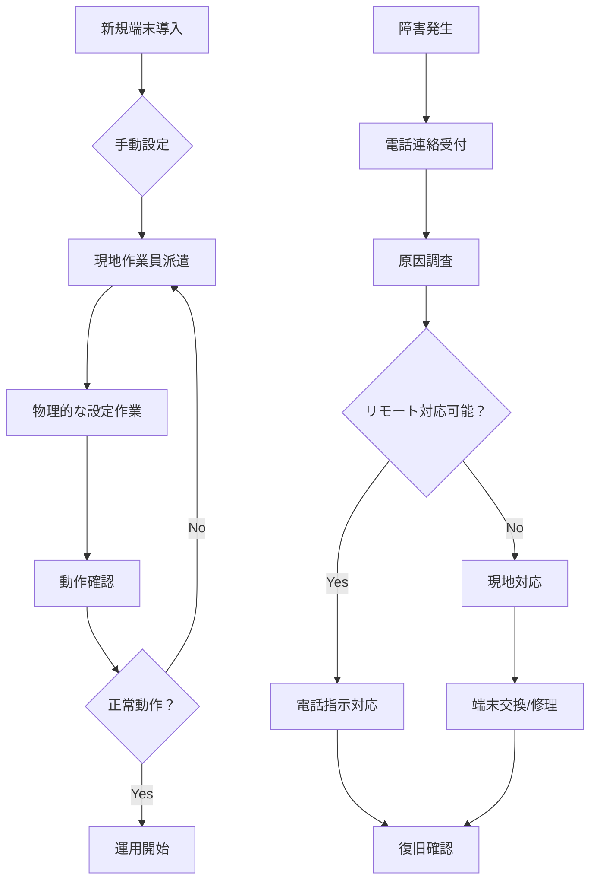
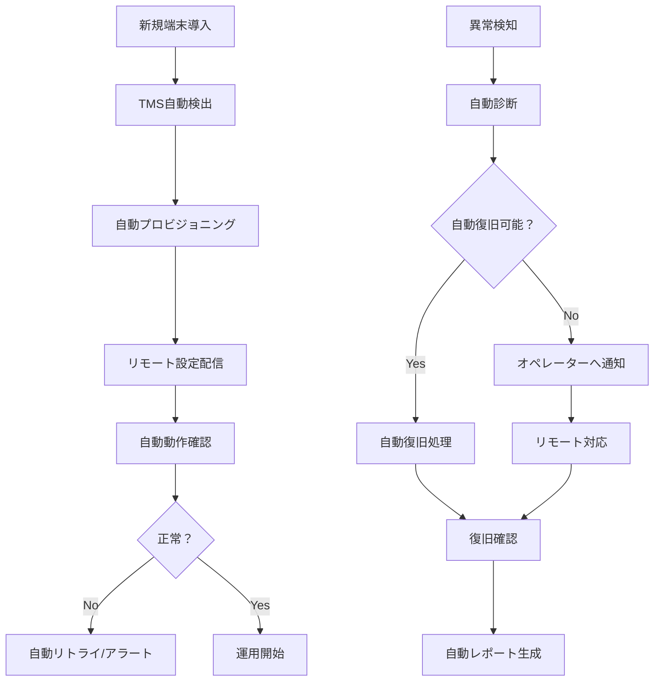
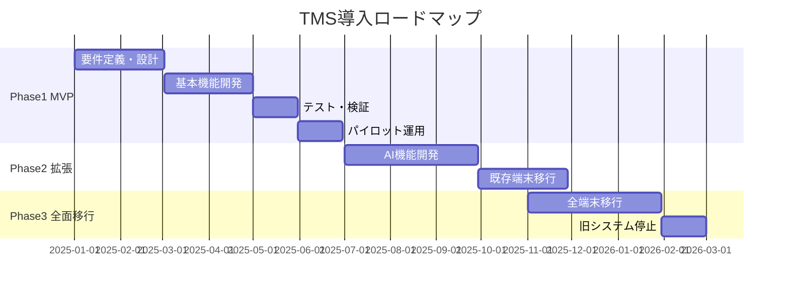

# As-Is / To-Be 業務整理
## TechCore Solutions TMS開発プロジェクト

**文書バージョン**: 1.0
**作成日**: 2025年11月23日
**ステータス**: ドラフト

---

## 1. As-Is（現状）業務フロー分析

### 1.1 現状の端末管理プロセス



### 1.2 現状の課題一覧

| No | 業務プロセス | 課題内容 | 影響度 | 頻度 | 改善優先度 |
|----|-------------|---------|--------|------|------------|
| 1 | **端末初期設定** | 現地での手動設定が必要（30分/台） | 高 | 高 | A |
| 2 | **ファームウェア更新** | 現地訪問または端末回収が必要 | 高 | 中 | A |
| 3 | **障害対応** | 原因特定に時間がかかる（平均4時間） | 高 | 高 | A |
| 4 | **パラメータ変更** | 個別対応で一括変更ができない | 中 | 高 | B |
| 5 | **端末状態監視** | リアルタイム監視ができない | 高 | 常時 | A |
| 6 | **鍵管理** | 物理的な鍵注入作業が必要 | 高 | 低 | B |
| 7 | **レポート作成** | 手動でデータ収集・集計 | 中 | 中 | C |
| 8 | **複数端末管理** | 統一的な管理画面がない | 中 | 高 | B |
| 9 | **履歴管理** | 作業履歴が分散している | 低 | 中 | C |
| 10 | **コスト管理** | PayConnectサービス利用料が高額 | 高 | 常時 | A |

### 1.3 現状の体制とツール

| 項目 | 現状 | 問題点 |
|------|------|--------|
| **管理ツール** | Excel + 個別管理システム | 統合されていない、手動作業多い |
| **監視方法** | 定期的な手動確認 | リアルタイム性なし、見逃しリスク |
| **対応体制** | 日中のみ（9-18時） | 夜間・休日対応が困難 |
| **ドキュメント** | 紙ベース + 散在するファイル | 検索性低い、更新漏れ |
| **コミュニケーション** | 電話 + メール | 履歴追跡困難、情報共有遅延 |

---

## 2. To-Be（理想）業務フロー

### 2.1 新システムでの端末管理プロセス



### 2.2 To-Be業務フロー詳細

#### 2.2.1 端末ライフサイクル管理

| フェーズ | As-Is（現状） | To-Be（理想） | 改善効果 |
|---------|--------------|--------------|----------|
| **調達** | 手動発注・在庫管理 | 需要予測による自動発注提案 | 在庫最適化 |
| **初期設定** | 現地で30分/台 | リモートで5分/台 | 83%時間削減 |
| **配布** | 物流 + 現地設定 | 物流のみ（Plug & Play） | 設定工数ゼロ |
| **運用** | 受動的な監視 | プロアクティブ監視 | 障害予防 |
| **更新** | 現地作業 | OTA自動更新 | 現地作業ゼロ |
| **廃棄** | 手動記録 | 自動廃棄処理・データ消去 | セキュリティ向上 |

#### 2.2.2 日常運用業務

| 業務 | 頻度 | As-Is | To-Be | 自動化率 |
|------|------|-------|--------|----------|
| **死活監視** | 常時 | 手動確認 | 自動監視・通知 | 100% |
| **パラメータ更新** | 週次 | 個別手動 | 一括自動配信 | 90% |
| **ログ収集** | 日次 | 手動取得 | 自動収集・分析 | 100% |
| **レポート作成** | 月次 | Excel手動 | 自動生成 | 95% |
| **障害対応** | 随時 | 全て手動 | 7割自動対応 | 70% |

### 2.3 To-Be実現のための機能要件

#### 必須機能（MVP）
1. **端末自動登録**: QRコード/シリアル番号での自動登録
2. **ゼロタッチプロビジョニング**: 電源ON時の自動設定
3. **OTA更新**: ファームウェア/アプリのリモート更新
4. **リアルタイム監視**: 24時間365日の自動監視
5. **基本的なAPI**: 外部システム連携用REST API

#### 差別化機能（Phase 2）
1. **AI障害予測**: 機械学習による予防保守
2. **音声操作**: 「TC-200の状態を教えて」等の音声コマンド
3. **チャットボット**: 自動応答による一次対応
4. **AR遠隔サポート**: 現地作業員へのAR指示

---

## 3. ビジネス要求一覧（BRD）

### 3.1 機能要求

| ID | カテゴリ | 要求事項 | 優先度 | 備考 |
|----|---------|---------|--------|------|
| BR-001 | 端末管理 | 10,000台以上の端末を同時管理できること | 必須 | スケーラビリティ重要 |
| BR-002 | 端末管理 | TC-200の全機能をリモート制御できること | 必須 | - |
| BR-003 | 端末管理 | 他社製端末も将来的に管理できること | 高 | 拡張性確保 |
| BR-004 | 監視 | 端末の死活監視が1分間隔で可能なこと | 必須 | - |
| BR-005 | 監視 | 異常時に5分以内に通知されること | 必須 | SLA要件 |
| BR-006 | 更新 | ファームウェアを無停止で更新できること | 高 | Blue-Green deployment |
| BR-007 | セキュリティ | PCI DSS準拠のセキュリティを確保すること | 必須 | コンプライアンス |
| BR-008 | セキュリティ | リモート鍵注入（RKI）が可能なこと | 高 | - |
| BR-009 | 分析 | 端末稼働率を可視化できること | 中 | KPI管理 |
| BR-010 | 分析 | 障害傾向を分析・予測できること | 中 | AI活用 |
| BR-011 | 操作性 | 技術者でなくても基本操作ができること | 高 | UI/UX重視 |
| BR-012 | 連携 | PayNet/CardLinkと連携できること | 中 | 日本市場対応 |
| BR-013 | 多言語 | 日本語/英語に対応すること | 必須 | - |
| BR-014 | 可用性 | 99.9%以上の稼働率を確保すること | 必須 | SLA |
| BR-015 | 性能 | 画面レスポンス3秒以内 | 高 | UX |

### 3.2 非機能要求（概要）

| カテゴリ | 要求レベル | 詳細 |
|---------|-----------|------|
| **可用性** | 99.9% | 年間ダウンタイム8.76時間以下 |
| **性能** | 高速 | ・画面表示3秒以内<br>・API応答1秒以内<br>・同時接続1,000ユーザー |
| **拡張性** | 高 | ・端末数10倍増加対応<br>・機能追加容易 |
| **セキュリティ** | 最高 | ・PCI DSS準拠<br>・暗号化通信<br>・監査ログ |
| **保守性** | 高 | ・ログによる追跡<br>・自動バックアップ |
| **移植性** | 中 | ・クラウド間移行可能 |

---

## 4. ユーザーストーリー（主要なもの）

### 4.1 オペレーター視点

```
As a 運用オペレーター
I want 異常な端末を自動で検知して通知を受け取りたい
So that 迅速に対応して、加盟店への影響を最小化できる
```

**受け入れ条件:**
- [ ] 端末異常を1分以内に検知
- [ ] メール/Slack/電話で通知
- [ ] 異常内容と推奨対応が表示される
- [ ] ワンクリックでリモート診断開始

### 4.2 加盟店管理者視点

```
As a 加盟店管理者
I want スマホから端末状態を確認したい
So that 店舗にいなくても状況を把握できる
```

**受け入れ条件:**
- [ ] スマホ対応のレスポンシブUI
- [ ] リアルタイムステータス表示
- [ ] 過去の取引履歴確認
- [ ] サポートへの問い合わせ機能

### 4.3 システム管理者視点

```
As a システム管理者
I want 一括で複数端末のファームウェアを更新したい
So that 効率的にセキュリティパッチを適用できる
```

**受け入れ条件:**
- [ ] 端末グループ選択機能
- [ ] スケジュール設定
- [ ] ロールバック機能
- [ ] 更新進捗の可視化

---

## 5. 業務フロー別の改善効果

### 5.1 定量的改善効果

| 業務 | As-Is | To-Be | 改善率 | 年間削減効果 |
|------|-------|-------|--------|-------------|
| 初期設定 | 30分/台 | 5分/台 | 83% | 2,500時間 |
| 障害対応 | 4時間/件 | 1時間/件 | 75% | 3,000時間 |
| 月次レポート | 8時間/月 | 0.5時間/月 | 94% | 90時間 |
| ファームウェア更新 | 60分/台 | 5分/台 | 92% | 5,500時間 |
| **合計工数削減** | - | - | - | **11,090時間** |
| **金額換算** | - | - | - | **約3,300万円** |

*前提: 時給3,000円、年間1,000台管理、障害100件/年

### 5.2 定性的改善効果

| 項目 | 改善内容 | ビジネスインパクト |
|------|---------|------------------|
| **顧客満足度** | 障害対応時間75%短縮 | クレーム減少、契約継続率向上 |
| **従業員満足度** | 単純作業の自動化 | モチベーション向上、離職率低下 |
| **競争力** | 独自機能による差別化 | 新規顧客獲得、単価向上 |
| **スケール** | 自動化により10倍対応可能 | 事業拡大の基盤 |
| **イノベーション** | データ活用による新サービス | 新規収益源 |

---

## 6. 移行計画（As-Is → To-Be）

### 6.1 段階的移行アプローチ



### 6.2 リスク軽減策

| リスク | 対策 |
|--------|------|
| **移行時の障害** | ・段階的移行<br>・ロールバック手順準備<br>・並行運用期間設定 |
| **ユーザー教育** | ・事前トレーニング実施<br>・マニュアル/動画作成<br>・ヘルプデスク強化 |
| **データ移行** | ・事前検証<br>・バックアップ確保<br>・段階的移行 |

---

## 7. 成功基準

### 7.1 プロジェクト成功の定義

| 観点 | 成功基準 | 測定方法 |
|------|---------|----------|
| **コスト** | 運用コスト50%削減 | 月次費用比較 |
| **品質** | 障害発生率50%削減 | インシデント管理 |
| **納期** | 2025年12月本番稼働 | プロジェクト管理 |
| **満足度** | ユーザー満足度80%以上 | アンケート調査 |

### 7.2 各フェーズの完了条件

#### Phase 1 (MVP) 完了条件
- [ ] 基本機能の実装完了
- [ ] TC-200での動作確認
- [ ] 100台での負荷試験合格
- [ ] セキュリティ監査合格

#### Phase 2 完了条件
- [ ] AI機能の実装完了
- [ ] 1,000台での運用確認
- [ ] 他社端末1機種対応

#### Phase 3 完了条件
- [ ] 全端末の移行完了
- [ ] 旧システム停止
- [ ] 運用引き継ぎ完了

---

## 8. 次のアクション

1. ✅ As-Is/To-Be分析完了
2. ⬜ ステークホルダーレビュー
3. ⬜ 機能要件の詳細化
4. ⬜ 画面設計開始
5. ⬜ データモデル設計

---

## 改訂履歴

| バージョン | 日付 | 変更内容 | 作成者 |
|-----------|------|----------|--------|
| 1.0 | 2025/11/23 | 初版作成 | Claude Code |