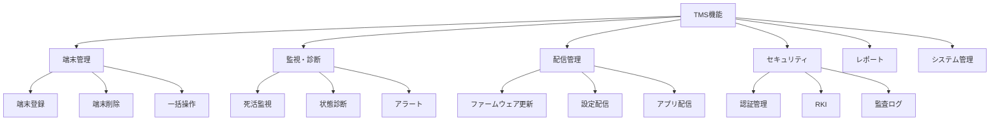
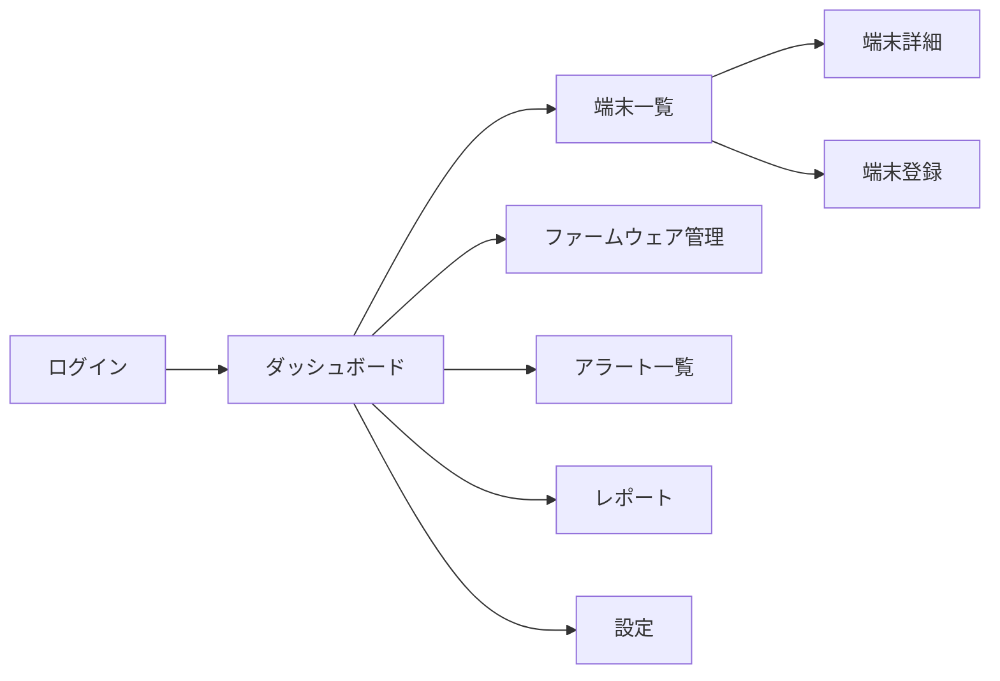

# 機能要件定義書
## TechCore Solutions TMS

**文書バージョン**: 1.0
**作成日**: 2025年11月23日
**開発規模**: 1人開発、10,000台対応

---

## 1. 機能一覧（優先順位付き）

### 1.1 機能マップ



### 1.2 実装優先度マトリックス

| 優先度 | 機能カテゴリ | 機能詳細 | 実装時期 |
|--------|------------|---------|----------|
| **P0:必須** | 端末管理 | 端末登録・削除・一覧 | Phase 1 (1ヶ月目) |
| **P0:必須** | 監視 | 死活監視（オンライン/オフライン） | Phase 1 (1ヶ月目) |
| **P0:必須** | システム | ユーザー認証・権限管理 | Phase 1 (1ヶ月目) |
| **P1:重要** | 配信 | ファームウェアOTA更新 | Phase 2 (2ヶ月目) |
| **P1:重要** | 配信 | パラメータ一括設定 | Phase 2 (2ヶ月目) |
| **P1:重要** | 監視 | アラート通知（メール） | Phase 2 (2ヶ月目) |
| **P2:推奨** | レポート | 基本レポート（稼働率等） | Phase 3 (3ヶ月目) |
| **P2:推奨** | 診断 | リモート診断機能 | Phase 3 (3ヶ月目) |
| **P2:推奨** | 監視 | 自動復旧機能 | Phase 3 (3ヶ月目) |
| **P3:将来** | セキュリティ | リモート鍵注入（RKI） | Phase 4 (4ヶ月目) |
| **P3:将来** | API | 外部システム連携API | Phase 4 (4ヶ月目) |
| **P3:将来** | 分析 | AI予測保守 | Phase 5 (6ヶ月目) |

---

## 2. 機能詳細仕様

### 2.1 端末管理機能（P0:必須）

#### FR-001: 端末登録

**概要**: 新規端末をTMSに登録する

**入力**:
- シリアル番号（必須、一意）
- 機種（デフォルト: TC-200）
- 設置場所（任意）
- 担当者（任意）

**処理**:
1. シリアル番号の重複チェック
2. データベースに登録
3. 初期ステータスを「未接続」に設定
4. 登録完了通知

**出力**:
- 登録成功/失敗メッセージ
- 端末ID

**実装サンプル（Django）**:
```python
# models.py
class Terminal(models.Model):
    serial_number = models.CharField(max_length=50, unique=True)
    model = models.CharField(max_length=20, default='TC-200')
    location = models.CharField(max_length=200, blank=True)
    responsible_person = models.CharField(max_length=100, blank=True)
    status = models.CharField(max_length=20, default='disconnected')
    created_at = models.DateTimeField(auto_now_add=True)

# views.py
def register_terminal(request):
    if request.method == 'POST':
        serial = request.POST.get('serial_number')
        # 重複チェック
        if Terminal.objects.filter(serial_number=serial).exists():
            return JsonResponse({'error': '既に登録済み'}, status=400)

        terminal = Terminal.objects.create(
            serial_number=serial,
            model=request.POST.get('model', 'TC-200'),
            location=request.POST.get('location', ''),
        )
        return JsonResponse({'id': terminal.id, 'message': '登録完了'})
```

#### FR-002: 端末一覧表示

**概要**: 登録端末の一覧を表示

**フィルター条件**:
- ステータス（オンライン/オフライン/エラー）
- 機種
- 設置場所
- 検索（シリアル番号）

**表示項目**:
- シリアル番号
- ステータス
- 最終通信時刻
- ファームウェアバージョン
- 設置場所

**ページネーション**: 100件/ページ

#### FR-003: 端末削除

**概要**: 端末を論理削除（履歴は保持）

**権限**: 管理者のみ

---

### 2.2 監視機能（P0:必須）

#### FR-010: 死活監視

**概要**: 端末の生存確認を定期的に実施

**監視間隔**:
- 通常: 5分
- 重要端末: 1分

**ステータス定義**:
| 状態 | 条件 |
|------|------|
| オンライン | 最終通信から5分以内 |
| オフライン | 最終通信から5分超過 |
| エラー | エラーレスポンス受信 |
| メンテナンス | 手動設定 |

**実装サンプル（定期タスク）**:
```python
# tasks.py (Celery)
from celery import shared_task
from datetime import datetime, timedelta

@shared_task
def check_terminal_health():
    # 5分以上通信がない端末を検出
    threshold = datetime.now() - timedelta(minutes=5)
    offline_terminals = Terminal.objects.filter(
        last_seen__lt=threshold,
        status='online'
    )

    for terminal in offline_terminals:
        terminal.status = 'offline'
        terminal.save()
        # アラート送信
        send_alert.delay(terminal.id, 'オフライン検出')

    return f'{offline_terminals.count()}台がオフライン'
```

#### FR-011: アラート通知

**トリガー条件**:
- オフライン移行
- エラー発生
- ファームウェア更新失敗
- 閾値超過（CPU/メモリ）

**通知方法**:
- Phase 1: メール
- Phase 2: Slack
- Phase 3: SMS

---

### 2.3 配信管理機能（P1:重要）

#### FR-020: ファームウェア更新

**概要**: OTA（Over-The-Air）でファームウェアを更新

**更新フロー**:
```
1. 更新ファイルアップロード
2. 対象端末選択（個別/グループ/全体）
3. スケジュール設定（即時/予約）
4. 配信実行
5. 進捗モニタリング
6. 結果確認
```

**実装のポイント**:
```python
# models.py
class FirmwareUpdate(models.Model):
    version = models.CharField(max_length=20)
    file = models.FileField(upload_to='firmware/')
    checksum = models.CharField(max_length=64)  # SHA256
    created_at = models.DateTimeField(auto_now_add=True)

class UpdateTask(models.Model):
    firmware = models.ForeignKey(FirmwareUpdate, on_delete=models.CASCADE)
    terminal = models.ForeignKey(Terminal, on_delete=models.CASCADE)
    status = models.CharField(max_length=20)  # pending/downloading/installing/completed/failed
    started_at = models.DateTimeField(null=True)
    completed_at = models.DateTimeField(null=True)
    error_message = models.TextField(blank=True)
```

#### FR-021: パラメータ設定

**設定可能項目**:
- 通信間隔
- サーバーURL
- タイムアウト値
- ログレベル
- その他端末固有設定

**配信方式**:
- 個別設定
- テンプレート適用
- 一括更新

---

### 2.4 セキュリティ機能（P2-P3）

#### FR-030: ユーザー認証・権限管理

**ユーザーロール**:

| ロール | 権限 |
|--------|------|
| 管理者 | 全機能 |
| オペレーター | 監視・基本操作 |
| 閲覧者 | 参照のみ |

**実装**: Django標準認証を使用

```python
# views.py
from django.contrib.auth.decorators import login_required, permission_required

@login_required
@permission_required('terminals.change_terminal')
def update_terminal(request, terminal_id):
    # 権限がある場合のみ実行
    pass
```

#### FR-031: 監査ログ

**記録項目**:
- 誰が（ユーザー）
- いつ（タイムスタンプ）
- 何を（操作内容）
- 対象（端末ID等）
- 結果（成功/失敗）

#### FR-032: リモート鍵注入（RKI）※Phase 4

**概要**: 暗号鍵を安全にリモート配信

---

### 2.5 レポート機能（P2:推奨）

#### FR-040: ダッシュボード

**表示項目**:
```
┌─────────────────────────────────┐
│  総端末数: 10,000               │
│  ┌──────┐ ┌──────┐ ┌──────┐  │
│  │Online│ │Offline│ │Error │  │
│  │ 9,500│ │  450 │ │  50  │  │
│  └──────┘ └──────┘ └──────┘  │
│                                 │
│  稼働率: 95.0%                  │
│  アラート: 5件                  │
└─────────────────────────────────┘
```

#### FR-041: 定期レポート

**レポート種別**:
- 日次: 稼働統計
- 週次: 障害サマリー
- 月次: 詳細分析

**出力形式**:
- 画面表示
- PDF
- CSV

---

## 3. 画面設計

### 3.1 画面一覧

| ID | 画面名 | URL | 説明 |
|----|--------|-----|------|
| S01 | ログイン | /login | ユーザー認証 |
| S02 | ダッシュボード | /dashboard | 概要表示 |
| S03 | 端末一覧 | /terminals | 端末リスト |
| S04 | 端末詳細 | /terminals/{id} | 個別詳細 |
| S05 | 端末登録 | /terminals/new | 新規登録 |
| S06 | ファームウェア管理 | /firmware | 更新管理 |
| S07 | アラート一覧 | /alerts | 通知確認 |
| S08 | レポート | /reports | 各種レポート |
| S09 | 設定 | /settings | システム設定 |

### 3.2 画面遷移図



### 3.3 レスポンシブ対応

- PC: フル機能
- タブレット: 主要機能
- スマホ: 監視・確認のみ

---

## 4. API仕様（Phase 4）

### 4.1 エンドポイント一覧

| メソッド | パス | 説明 |
|---------|------|------|
| GET | /api/v1/terminals | 端末一覧取得 |
| GET | /api/v1/terminals/{id} | 端末詳細取得 |
| POST | /api/v1/terminals | 端末登録 |
| PUT | /api/v1/terminals/{id} | 端末更新 |
| DELETE | /api/v1/terminals/{id} | 端末削除 |
| POST | /api/v1/terminals/{id}/reboot | 再起動指示 |
| GET | /api/v1/terminals/{id}/logs | ログ取得 |

### 4.2 認証方式

- トークン認証（Django REST Framework Token）
- 将来: OAuth 2.0

---

## 5. データフロー

### 5.1 端末→TMS通信

```
端末 --HTTPS--> TMS
    ↓
    JSON {
        "serial": "TC-200-001",
        "timestamp": "2025-01-01T12:00:00Z",
        "status": "online",
        "metrics": {
            "cpu": 45,
            "memory": 60,
            "disk": 30
        }
    }
```

### 5.2 TMS→端末指示

```
TMS --HTTPS--> 端末
    ↓
    JSON {
        "command": "update_firmware",
        "parameters": {
            "version": "2.0.0",
            "url": "https://tms.example.com/firmware/2.0.0.bin",
            "checksum": "abc123..."
        }
    }
```

---

## 6. エラー処理

### 6.1 エラーコード体系

| コード | 意味 | 対処 |
|--------|------|------|
| E001 | 通信タイムアウト | 自動リトライ |
| E002 | 認証失敗 | 手動確認要 |
| E003 | データ不整合 | ログ記録・通知 |
| E004 | 容量不足 | アラート送信 |
| E005 | ファームウェア不正 | 更新中止 |

### 6.2 リトライ戦略

```python
# 指数バックオフでリトライ
import time

def retry_with_backoff(func, max_retries=3):
    for i in range(max_retries):
        try:
            return func()
        except Exception as e:
            if i == max_retries - 1:
                raise
            wait_time = 2 ** i  # 1, 2, 4秒
            time.sleep(wait_time)
```

---

## 7. 性能要件

### 7.1 レスポンスタイム

| 操作 | 目標時間 | 最大許容 |
|------|---------|----------|
| ログイン | 1秒 | 3秒 |
| 一覧表示(100件) | 2秒 | 5秒 |
| 詳細表示 | 1秒 | 3秒 |
| 更新処理 | 3秒 | 10秒 |

### 7.2 同時接続数

- 管理画面: 100ユーザー
- 端末通信: 10,000台
- API: 1,000 req/sec

---

## 8. 実装ロードマップ詳細

### Month 1: 基礎構築
- [ ] Week 1-2: Django学習・環境構築
- [ ] Week 3: 端末モデル・管理画面
- [ ] Week 4: 基本的な一覧・詳細画面

### Month 2: コア機能
- [ ] Week 5-6: 死活監視実装
- [ ] Week 7-8: ファームウェア更新機能

### Month 3: 運用機能
- [ ] Week 9-10: アラート・通知
- [ ] Week 11-12: レポート機能

### Month 4-6: 拡張
- [ ] API開発
- [ ] セキュリティ強化
- [ ] 性能最適化

---

## 改訂履歴

| バージョン | 日付 | 変更内容 |
|-----------|------|----------|
| 1.0 | 2025/11/23 | 初版作成 |