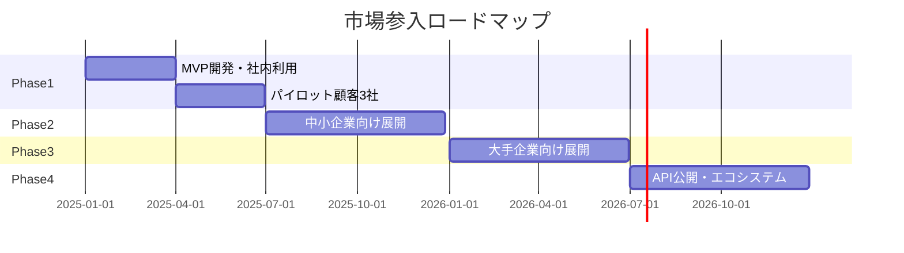

# TMSビジネスモデル分析
## TechCore Solutions向け推奨戦略

**作成日**: 2025年11月23日

---

## 1. 推奨ビジネスモデル：マルチテナント型SaaS

### 1.1 基本構造

```
┌─────────────────────────────────────┐
│         TechCore TMS              │
│      （マルチテナント対応）          │
├──────────┬──────────┬──────────────┤
│ テナントA │ テナントB │ テナントC    │
│ (大手)    │ (中堅)    │ (小規模)     │
└──────────┴──────────┴──────────────┘
```

### 1.2 顧客セグメント別アプローチ

| セグメント | 企業規模 | 端末数 | 提供形態 | 料金モデル |
|-----------|---------|--------|---------|-----------|
| **エンタープライズ** | 大手チェーン | 100台以上 | 専用環境＋カスタマイズ | 年間ライセンス |
| **ミッドマーケット** | 中堅企業 | 20-100台 | 共有環境＋設定変更 | 月額従量制 |
| **スモールビジネス** | 個人店舗 | 1-20台 | 共有環境＋標準機能 | 月額定額制 |
| **サポート契約** | 全規模 | - | リモートサポート | インシデント課金 |

---

## 2. システムアーキテクチャ

### 2.1 マルチテナント対応設計

```python
# models.py - マルチテナント対応
from django.db import models

class Company(models.Model):
    """顧客企業（テナント）"""
    name = models.CharField(max_length=100)
    plan = models.CharField(
        max_length=20,
        choices=[
            ('enterprise', 'エンタープライズ'),
            ('standard', 'スタンダード'),
            ('basic', 'ベーシック'),
        ]
    )
    max_terminals = models.IntegerField()  # 契約端末数上限
    contract_start = models.DateField()
    contract_end = models.DateField()
    is_active = models.BooleanField(default=True)

class Terminal(models.Model):
    """端末（どの企業の端末か紐付け）"""
    company = models.ForeignKey(Company, on_delete=models.CASCADE)
    serial_number = models.CharField(max_length=50)
    store_name = models.CharField(max_length=100)
    # ... その他フィールド

class TMSUser(models.Model):
    """ユーザー（どの企業のユーザーか）"""
    company = models.ForeignKey(Company, on_delete=models.CASCADE)
    user = models.OneToOneField('auth.User', on_delete=models.CASCADE)
    role = models.CharField(
        max_length=20,
        choices=[
            ('admin', '管理者'),
            ('operator', 'オペレーター'),
            ('viewer', '閲覧者'),
        ]
    )
```

### 2.2 データ分離の仕組み

```python
# views.py - テナントごとのデータ分離
from django.contrib.auth.decorators import login_required

@login_required
def terminal_list(request):
    # ログインユーザーの企業を特定
    user_company = request.user.tmsuser.company

    # その企業の端末のみ表示
    terminals = Terminal.objects.filter(company=user_company)

    return render(request, 'terminal_list.html', {
        'terminals': terminals,
        'company': user_company
    })
```

---

## 3. 料金体系の提案

### 3.1 基本プラン

| プラン | 月額基本料 | 含まれる端末数 | 追加端末 | 機能 |
|--------|-----------|---------------|---------|------|
| **Basic** | ¥10,000 | 10台まで | ¥1,000/台 | 基本機能のみ |
| **Standard** | ¥30,000 | 50台まで | ¥800/台 | ＋レポート・API |
| **Enterprise** | ¥100,000 | 200台まで | ¥500/台 | ＋カスタマイズ・優先サポート |

### 3.2 オプションサービス

| サービス | 料金 | 内容 |
|---------|------|------|
| **24時間監視** | ¥20,000/月 | 障害時の自動対応 |
| **オンサイト対応** | ¥50,000/回 | 現地での設定・修理 |
| **カスタマイズ開発** | 要見積 | 顧客専用機能開発 |
| **データ分析レポート** | ¥10,000/月 | 月次分析レポート提供 |

---

## 4. 競合他社との差別化戦略

### 4.1 TechCoreの強み

| 項目 | TechCoreの優位性 | 実現方法 |
|------|-----------------|----------|
| **ハードウェア統合** | TC-200との深い統合 | 専用API、ファームウェア連携 |
| **国内サポート** | 日本語完全対応 | 国内サポートセンター |
| **カスタマイズ性** | 日本市場のニーズ理解 | 柔軟な機能追加 |
| **価格競争力** | 自社開発による低コスト | PayConnect等より50%安価 |

### 4.2 段階的な市場参入戦略



---

## 5. 収益シミュレーション

### 5.1 顧客獲得シナリオ

| 時期 | Basic | Standard | Enterprise | 月間売上 | 年間売上 |
|------|-------|----------|------------|----------|----------|
| 6ヶ月後 | 10社 | 3社 | 0社 | ¥190,000 | - |
| 1年後 | 30社 | 10社 | 2社 | ¥800,000 | ¥9,600,000 |
| 2年後 | 50社 | 20社 | 5社 | ¥1,600,000 | ¥19,200,000 |
| 3年後 | 80社 | 35社 | 10社 | ¥2,850,000 | ¥34,200,000 |

### 5.2 損益分岐点

- **初期投資**: 開発費 ¥500万（人件費6ヶ月）
- **月間運用コスト**: ¥10万（AWS、サポート人件費）
- **損益分岐点**: 月間売上 ¥50万（顧客数約30社）
- **到達予想**: 8-10ヶ月

---

## 6. リスクと対策

| リスク | 影響 | 対策 |
|--------|------|------|
| **顧客データ漏洩** | 致命的 | ・データ暗号化<br>・アクセス制御<br>・監査ログ |
| **システム障害** | 高 | ・冗長化<br>・自動フェイルオーバー<br>・SLA締結 |
| **競合参入** | 中 | ・機能差別化<br>・顧客ロックイン<br>・価格優位性 |
| **規制変更** | 中 | ・コンプライアンス体制<br>・柔軟な設計 |

---

## 7. 実装の優先順位（マルチテナント対応）

### Phase 1: シングルテナント版（3ヶ月）
- 1社向けの基本機能実装
- 社内またはパイロット顧客で検証

### Phase 2: マルチテナント化（2ヶ月）
- データ分離機能追加
- 権限管理強化
- 課金システム連携

### Phase 3: セルフサービス化（2ヶ月）
- 顧客自身での端末登録
- オンラインサポート
- 利用状況ダッシュボード

---

## 8. 意思決定が必要な項目

### 🔴 至急決定

1. **ターゲット市場**
   - [ ] 中小企業中心（数量重視）
   - [ ] 大手企業中心（単価重視）
   - [ ] 両方（推奨）

2. **初期リリース形態**
   - [ ] 限定顧客向けパイロット
   - [ ] 自社利用から開始
   - [ ] 即座に一般公開

3. **料金モデル**
   - [ ] 月額サブスクリプション（推奨）
   - [ ] 年間ライセンス
   - [ ] 買い切り＋保守料

### 🟡 後日決定可

- ブランド名
- マーケティング戦略
- パートナー戦略

---

## 9. アクションプラン

### 今週やること
1. ビジネスモデルの社内承認
2. パイロット顧客候補リストアップ
3. MVP機能の最終確定

### 今月やること
1. プロトタイプ開発開始
2. パイロット顧客との要件すり合わせ
3. 料金体系の詳細設計

### 3ヶ月後の目標
- パイロット版稼働
- 3社での実証実験開始
- フィードバック収集と改善

---

## 結論

**推奨方向性**：
- **マルチテナント型SaaS**として開発
- **中小企業**から開始し、徐々に大手へ展開
- **月額課金モデル**で安定収益確保

これにより、PayConnectのようなサービス利用料を払う側から、**サービス提供で収益を得る側**へ転換できます。