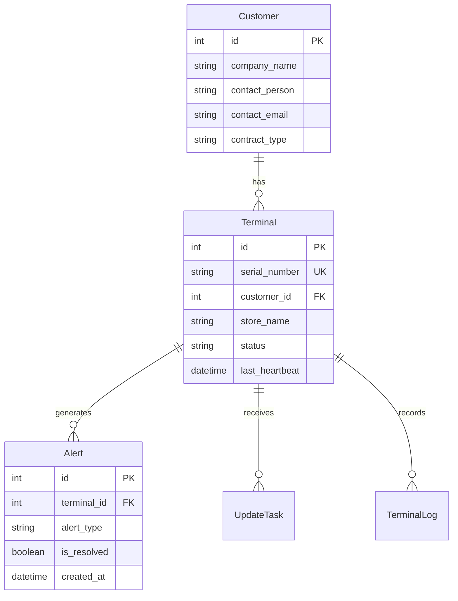
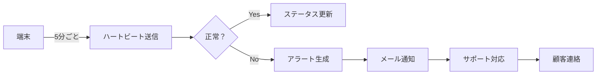
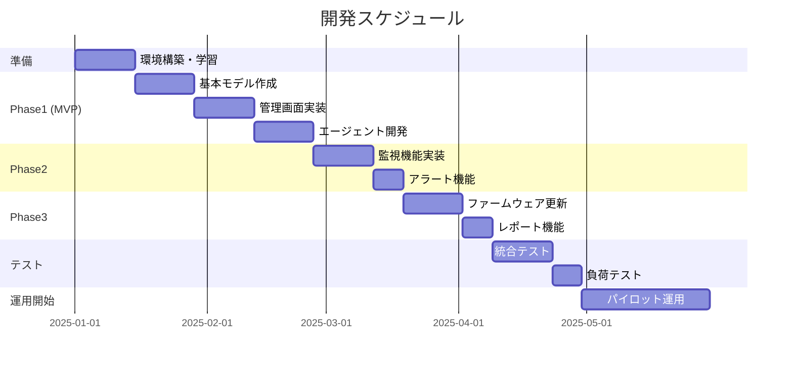

# TMSシステムアーキテクチャ設計書（確定版）
## TechCore Solutions 端末管理システム

**文書バージョン**: 1.0
**作成日**: 2025年11月23日
**運用形態**: TechCoreによる一元管理型

---

## 1. システム概要

### 1.1 基本方針
- **運用主体**: TechCore Solutionsのサポートチーム
- **管理対象**: 全顧客のTC-200端末（10,000台規模）
- **利用者**: TechCore社内の運用チーム（5-10名）
- **顧客の関与**: 障害連絡のみ（直接操作なし）

### 1.2 システム構成図

```
┌──────────────────────────────────────────────┐
│         TechCore Solutions本社                │
│                                                │
│  ┌──────────────┐    ┌──────────────┐      │
│  │ TMS管理画面   │    │  サポート     │      │
│  │  (Django)     │←──→│   チーム      │      │
│  └──────────────┘    └──────────────┘      │
│         ↑                                      │
└─────────┼──────────────────────────────────┘
          │ HTTPS (AWS)
          │
    ┌─────┴─────────────────────┐
    │                           │
┌───┴────┐  ┌────┴────┐  ┌────┴────┐
│顧客A社  │  │顧客B社   │  │顧客C社   │
│         │  │          │  │          │
│TC-200   │  │TC-200    │  │TC-200    │
│↓USB     │  │↓USB      │  │↓USB      │
│店舗PC   │  │店舗PC    │  │店舗PC    │
│(Agent)  │  │(Agent)   │  │(Agent)   │
└─────────┘  └──────────┘  └──────────┘
```

---

## 2. データ設計（シンプル版）

### 2.1 主要テーブル設計

```python
# models.py - 顧客管理機能付き

from django.db import models

class Customer(models.Model):
    """顧客企業マスター（TC-200の販売先）"""
    company_name = models.CharField(max_length=100, verbose_name='会社名')
    contact_person = models.CharField(max_length=50, verbose_name='担当者')
    contact_email = models.EmailField(verbose_name='連絡先メール')
    contact_phone = models.CharField(max_length=20, verbose_name='電話番号')
    contract_type = models.CharField(
        max_length=20,
        choices=[
            ('basic', 'ベーシック保守'),
            ('standard', 'スタンダード保守'),
            ('premium', 'プレミアム保守'),
        ],
        default='basic',
        verbose_name='契約種別'
    )
    created_at = models.DateTimeField(auto_now_add=True)

    class Meta:
        verbose_name = '顧客企業'
        verbose_name_plural = '顧客企業一覧'

    def __str__(self):
        return self.company_name


class Terminal(models.Model):
    """端末マスター"""
    serial_number = models.CharField(
        max_length=50,
        unique=True,
        verbose_name='シリアル番号'
    )
    customer = models.ForeignKey(
        Customer,
        on_delete=models.CASCADE,
        related_name='terminals',
        verbose_name='顧客企業'
    )
    store_name = models.CharField(
        max_length=100,
        verbose_name='設置店舗名',
        help_text='例: ○○店舗 レジ1番'
    )
    status = models.CharField(
        max_length=20,
        choices=[
            ('online', 'オンライン'),
            ('offline', 'オフライン'),
            ('error', 'エラー'),
            ('maintenance', 'メンテナンス中'),
        ],
        default='offline',
        verbose_name='状態'
    )
    firmware_version = models.CharField(
        max_length=20,
        default='1.0.0',
        verbose_name='ファームウェア'
    )
    last_heartbeat = models.DateTimeField(
        null=True,
        blank=True,
        verbose_name='最終通信'
    )
    installed_date = models.DateField(
        null=True,
        blank=True,
        verbose_name='設置日'
    )

    # メタ情報
    cpu_usage = models.IntegerField(default=0)
    memory_usage = models.IntegerField(default=0)
    disk_usage = models.IntegerField(default=0)

    created_at = models.DateTimeField(auto_now_add=True)
    updated_at = models.DateTimeField(auto_now=True)

    class Meta:
        verbose_name = '端末'
        verbose_name_plural = '端末一覧'
        ordering = ['customer', 'store_name']

    def __str__(self):
        return f'{self.serial_number} ({self.customer.company_name} - {self.store_name})'


class Alert(models.Model):
    """アラート（障害通知）"""
    terminal = models.ForeignKey(
        Terminal,
        on_delete=models.CASCADE,
        related_name='alerts'
    )
    alert_type = models.CharField(
        max_length=20,
        choices=[
            ('offline', 'オフライン'),
            ('error', 'エラー'),
            ('high_cpu', 'CPU使用率高'),
            ('high_memory', 'メモリ使用率高'),
            ('update_failed', '更新失敗'),
        ],
        verbose_name='アラート種別'
    )
    message = models.TextField(verbose_name='詳細メッセージ')
    is_resolved = models.BooleanField(default=False, verbose_name='解決済み')
    created_at = models.DateTimeField(auto_now_add=True)
    resolved_at = models.DateTimeField(null=True, blank=True)
    resolved_by = models.CharField(max_length=50, blank=True)

    class Meta:
        verbose_name = 'アラート'
        verbose_name_plural = 'アラート一覧'
        ordering = ['-created_at']
```

### 2.2 ER図



---

## 3. 画面設計（TechCore運用チーム用）

### 3.1 画面一覧

| No | 画面名 | URL | 説明 | 主な利用者 |
|----|--------|-----|------|-----------|
| 1 | ログイン | /login | 認証画面 | 全員 |
| 2 | ダッシュボード | /dashboard | 全体状況把握 | 運用チーム |
| 3 | 顧客一覧 | /customers | 顧客管理 | 管理者 |
| 4 | 端末一覧 | /terminals | 端末状態確認 | 運用チーム |
| 5 | アラート一覧 | /alerts | 障害対応 | サポート |
| 6 | 端末詳細 | /terminals/{id} | 個別診断 | サポート |
| 7 | ファームウェア管理 | /firmware | 更新管理 | 管理者 |
| 8 | レポート | /reports | 月次報告書 | 管理者 |

### 3.2 ダッシュボード画面イメージ

```
┌────────────────────────────────────────────────┐
│  📊 TMS ダッシュボード          [田中] ログアウト │
├────────────────────────────────────────────────┤
│                                                │
│  ┌──────────┐ ┌──────────┐ ┌──────────┐    │
│  │ 総端末数  │ │ オンライン│ │ アラート  │    │
│  │  10,234  │ │   9,876   │ │    15    │    │
│  └──────────┘ └──────────┘ └──────────┘    │
│                                                │
│  稼働率: 96.5%  [=============  ]              │
│                                                │
│  【重要アラート】                               │
│  ⚠ ABC商事 - 新宿店: オフライン (10分前)        │
│  ⚠ XYZ商店 - 渋谷店: CPU使用率90% (5分前)      │
│                                                │
│  【顧客別状況】                                 │
│  ┌─────────────────────────────────────┐    │
│  │ 顧客名      │端末数│オンライン│エラー│    │
│  ├─────────────────────────────────────┤    │
│  │ ABC商事     │ 523 │   520    │  1  │    │
│  │ XYZ商店     │ 312 │   310    │  2  │    │
│  │ 田中ストア   │  89 │    89    │  0  │    │
│  └─────────────────────────────────────┘    │
└────────────────────────────────────────────────┘
```

---

## 4. 運用フロー

### 4.1 日常運用



### 4.2 障害対応フロー

| Step | アクション | 担当 | 時間目標 |
|------|-----------|------|----------|
| 1 | アラート検知 | システム | 即時 |
| 2 | 初動確認 | 運用チーム | 5分以内 |
| 3 | リモート診断 | 運用チーム | 15分以内 |
| 4 | 顧客連絡 | サポート | 30分以内 |
| 5 | 対応実施 | 運用チーム | 1時間以内 |
| 6 | 完了報告 | サポート | 対応後即時 |

---

## 5. セキュリティ設計

### 5.1 アクセス制御

```python
# TechCore社内のみアクセス可能
ALLOWED_HOSTS = ['tms.techcore-internal.jp']

# IPアドレス制限
ALLOWED_IPS = [
    '203.0.113.0/24',  # TechCore本社
    '198.51.100.0/24', # TechCoreデータセンター
]

# ユーザー権限
class TMSUser(models.Model):
    ROLE_CHOICES = [
        ('admin', 'システム管理者'),     # 全機能
        ('operator', '運用オペレーター'),  # 監視・基本操作
        ('support', 'サポート担当'),      # 閲覧・顧客対応
        ('viewer', '閲覧のみ'),          # レポート閲覧
    ]
```

### 5.2 通信セキュリティ

- エージェント⇔TMS: HTTPS必須
- 認証: トークン認証（各端末に固有トークン）
- ログ: 全操作を記録

---

## 6. 非機能要件

### 6.1 性能要件

| 項目 | 要件 | 備考 |
|------|------|------|
| 同時管理端末数 | 10,000台以上 | 将来20,000台まで拡張 |
| 同時接続エージェント | 10,000 | 5分間隔での通信 |
| 画面レスポンス | 3秒以内 | 一覧表示含む |
| データ保持期間 | 1年 | ログ・履歴データ |

### 6.2 可用性要件

- サービス稼働率: 99.5%（月43分まで停止許容）
- バックアップ: 日次
- 災害復旧: 24時間以内

---

## 7. 開発スケジュール（1人開発前提）



---

## 8. コスト比較

### 8.1 PayConnect利用時 vs 自社開発

| 項目 | PayConnect利用（現状） | 自社開発 | 削減率 |
|------|----------------|----------|--------|
| 初期費用 | 200万円 | 500万円（開発費） | - |
| 月額費用 | 10万円/月 | 2.3万円/月（AWS） | 77% |
| 年間コスト | 120万円/年 | 27.6万円/年 | 77% |
| 3年総額 | 560万円 | 582.8万円 | -4% |
| 5年総額 | 800万円 | 638万円 | 20% |

**損益分岐点**: 約3年（開発費を回収）

### 8.2 追加収益の可能性

自社TMSを持つことで：
- 保守サービスの付加価値向上
- 月額保守料の値上げ余地（年間1000万円増の可能性）
- 差別化による新規顧客獲得

---

## 9. リスクと対策

| リスク | 影響 | 対策 |
|--------|------|------|
| 1人開発の限界 | 高 | ・段階的開発<br>・外注の検討<br>・既存ツール活用 |
| セキュリティ事故 | 高 | ・標準機能利用<br>・定期診断<br>・保険加入 |
| 性能問題 | 中 | ・クラウド活用<br>・キャッシュ利用<br>・CDN導入 |

---

## 10. 成功の定義

### 短期（6ヶ月）
✅ 100台での安定稼働
✅ 基本機能の実装完了
✅ PayConnectからの移行開始

### 中期（1年）
✅ 1,000台での運用
✅ 運用コスト50%削減達成
✅ 障害対応時間50%短縮

### 長期（2年）
✅ 10,000台フル稼働
✅ 黒字化達成
✅ 次期製品への展開

---

## まとめ

このTMSは：
- **TechCoreが全顧客端末を一元管理**するシステム
- **顧客は直接操作しない**（サポート経由）
- **シンプルな設計**で1人でも開発可能
- **3年で投資回収**、5年で20%のコスト削減

次のアクション：
1. Django環境構築
2. 基本モデル作成
3. 管理画面実装