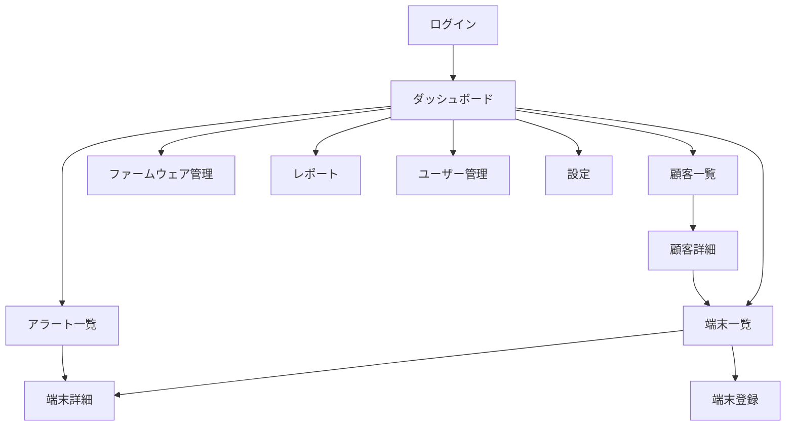

# 画面詳細仕様書
## TechCore Solutions TMS

**文書バージョン**: 1.0
**作成日**: 2025年11月24日
**対象**: Devin自動実装用

---

## 1. 画面一覧と遷移

### 1.1 画面一覧

| ID | 画面名 | URL | ファイル名 | 権限 |
|----|--------|-----|-----------|------|
| SC001 | ログイン | /login | login.html | 全員 |
| SC002 | ダッシュボード | /dashboard | dashboard.html | 全員（要ログイン） |
| SC003 | 端末一覧 | /terminals | terminal_list.html | 全員 |
| SC004 | 端末詳細 | /terminals/{id} | terminal_detail.html | 全員 |
| SC005 | 端末登録 | /terminals/new | terminal_new.html | admin, operator |
| SC006 | 顧客一覧 | /customers | customer_list.html | admin, operator |
| SC007 | 顧客詳細 | /customers/{id} | customer_detail.html | admin, operator |
| SC008 | アラート一覧 | /alerts | alert_list.html | 全員 |
| SC009 | ファームウェア管理 | /firmware | firmware_list.html | admin |
| SC010 | レポート | /reports | report.html | admin, operator |
| SC011 | ユーザー管理 | /users | user_list.html | admin |
| SC012 | 設定 | /settings | settings.html | admin |

### 1.2 画面遷移図



---

## 2. 共通仕様

### 2.1 レイアウト構成

```html
<!DOCTYPE html>
<html lang="ja">
<head>
    <meta charset="UTF-8">
    <meta name="viewport" content="width=device-width, initial-scale=1.0">
    <title>TMS - {ページタイトル}</title>
    <link href="https://cdn.jsdelivr.net/npm/bootstrap@5.3.0/dist/css/bootstrap.min.css" rel="stylesheet">
    <link href="/static/css/style.css" rel="stylesheet">
</head>
<body>
    <!-- ヘッダー -->
    <nav class="navbar navbar-expand-lg navbar-dark bg-primary">
        <div class="container-fluid">
            <a class="navbar-brand" href="/dashboard">
                
                TMS
            </a>
            <div class="navbar-nav ms-auto">
                <span class="navbar-text me-3">
                    {ユーザー名} ({ロール})
                </span>
                <a class="btn btn-outline-light btn-sm" href="/logout">ログアウト</a>
            </div>
        </div>
    </nav>

    <!-- サイドバー + メインコンテンツ -->
    <div class="container-fluid">
        <div class="row">
            <!-- サイドバー -->
            <nav class="col-md-2 bg-light sidebar">
                <div class="position-sticky pt-3">
                    <ul class="nav flex-column">
                        <li class="nav-item">
                            <a class="nav-link" href="/dashboard">
                                <i class="bi bi-speedometer2"></i> ダッシュボード
                            </a>
                        </li>
                        <li class="nav-item">
                            <a class="nav-link" href="/terminals">
                                <i class="bi bi-pc-display"></i> 端末管理
                            </a>
                        </li>
                        <li class="nav-item">
                            <a class="nav-link" href="/customers">
                                <i class="bi bi-building"></i> 顧客管理
                            </a>
                        </li>
                        <li class="nav-item">
                            <a class="nav-link" href="/alerts">
                                <i class="bi bi-bell"></i> アラート
                                <span class="badge bg-danger">5</span>
                            </a>
                        </li>
                        <li class="nav-item">
                            <a class="nav-link" href="/firmware">
                                <i class="bi bi-download"></i> ファームウェア
                            </a>
                        </li>
                        <li class="nav-item">
                            <a class="nav-link" href="/reports">
                                <i class="bi bi-graph-up"></i> レポート
                            </a>
                        </li>
                        <li class="nav-item">
                            <a class="nav-link" href="/users">
                                <i class="bi bi-people"></i> ユーザー管理
                            </a>
                        </li>
                        <li class="nav-item">
                            <a class="nav-link" href="/settings">
                                <i class="bi bi-gear"></i> 設定
                            </a>
                        </li>
                    </ul>
                </div>
            </nav>

            <!-- メインコンテンツ -->
            <main class="col-md-10 ms-sm-auto px-md-4">
                {コンテンツ}
            </main>
        </div>
    </div>

    <!-- フッター -->
    <footer class="footer mt-auto py-3 bg-light">
        <div class="container text-center">
            <span class="text-muted">© 2025 TechCore Solutions</span>
        </div>
    </footer>

    <script src="https://cdn.jsdelivr.net/npm/bootstrap@5.3.0/dist/js/bootstrap.bundle.min.js"></script>
    <script src="/static/js/app.js"></script>
</body>
</html>
```

### 2.2 カラースキーム

| 要素 | 色 | HEXコード | 用途 |
|------|-----|----------|------|
| Primary | 青 | #0056b3 | ヘッダー、主要ボタン |
| Success | 緑 | #28a745 | オンライン状態、成功メッセージ |
| Warning | 黄 | #ffc107 | 警告、注意 |
| Danger | 赤 | #dc3545 | エラー、オフライン状態 |
| Info | 水色 | #17a2b8 | 情報表示 |
| Light | 薄灰 | #f8f9fa | 背景 |
| Dark | 濃灰 | #343a40 | テキスト |

### 2.3 レスポンシブ対応

- **デスクトップ** (≥1200px): フル表示
- **タブレット** (768px-1199px): サイドバー折りたたみ
- **スマートフォン** (<768px): 縦スクロール、簡易表示

---

## 3. 各画面詳細

### SC001: ログイン画面

#### 画面イメージ
```
┌──────────────────────────────────────────┐
│                                          │
│            NIDEC TMS ロゴ                │
│                                          │
│        ┌────────────────────┐           │
│        │ ユーザー名         │           │
│        └────────────────────┘           │
│                                          │
│        ┌────────────────────┐           │
│        │ パスワード         │           │
│        └────────────────────┘           │
│                                          │
│        □ ログイン状態を保持             │
│                                          │
│        ┌────────────────────┐           │
│        │    ログイン        │           │
│        └────────────────────┘           │
│                                          │
│        パスワードを忘れた方              │
│                                          │
└──────────────────────────────────────────┘
```

#### HTML実装
```html
<div class="container mt-5">
    <div class="row justify-content-center">
        <div class="col-md-4">
            <div class="card">
                <div class="card-body">
                    <div class="text-center mb-4">
                        
                        <h4 class="mt-3">Terminal Management System</h4>
                    </div>

                    <form method="POST" action="/login">
                        

                        <!-- エラーメッセージ -->
                        
                        <div class="alert alert-danger" role="alert">
                            {{ error }}
                        </div>
                        

                        <div class="mb-3">
                            <label for="username" class="form-label">ユーザー名</label>
                            <input type="text" class="form-control" id="username" name="username"
                                   required autofocus>
                        </div>

                        <div class="mb-3">
                            <label for="password" class="form-label">パスワード</label>
                            <input type="password" class="form-control" id="password" name="password"
                                   required>
                        </div>

                        <div class="mb-3 form-check">
                            <input type="checkbox" class="form-check-input" id="remember" name="remember">
                            <label class="form-check-label" for="remember">
                                ログイン状態を保持
                            </label>
                        </div>

                        <button type="submit" class="btn btn-primary w-100">ログイン</button>
                    </form>

                    <div class="text-center mt-3">
                        <a href="/password-reset" class="text-muted small">パスワードを忘れた方</a>
                    </div>
                </div>
            </div>
        </div>
    </div>
</div>
```

### SC002: ダッシュボード

#### 画面イメージ
```
┌──────────────────────────────────────────────────────┐
│  ダッシュボード                   最終更新: 10:30:45   │
├──────────────────────────────────────────────────────┤
│                                                      │
│  ┌──────────┐ ┌──────────┐ ┌──────────┐ ┌──────────┐
│  │総端末数   │ │オンライン │ │オフライン │ │エラー    │
│  │  10,234  │ │   9,876   │ │    350    │ │    8     │
│  │          │ │   96.5%   │ │    3.4%   │ │   0.1%   │
│  └──────────┘ └──────────┘ └──────────┘ └──────────┘
│                                                      │
│  稼働率推移（過去7日間）                             │
│  ┌──────────────────────────────────────────────┐  │
│  │ [グラフ: 折れ線グラフ]                       │  │
│  └──────────────────────────────────────────────┘  │
│                                                      │
│  最新アラート                        全て見る >      │
│  ┌──────────────────────────────────────────────┐  │
│  │ ⚠ TC-200-001 オフライン         10分前        │  │
│  │ ⚠ TC-200-045 CPU使用率90%       5分前         │  │
│  │ ℹ TC-200-123 ファームウェア更新完了 2分前      │  │
│  └──────────────────────────────────────────────┘  │
│                                                      │
│  顧客別状況                                          │
│  ┌──────────────────────────────────────────────┐  │
│  │ 顧客名        │端末数│オンライン│稼働率│     │
│  │ ABCストア     │ 523  │   520    │ 99.4%│     │
│  │ XYZ商事       │ 312  │   310    │ 99.3%│     │
│  │ 田中商店      │  89  │    85    │ 95.5%│     │
│  └──────────────────────────────────────────────┘  │
└──────────────────────────────────────────────────────┘
```

#### HTML実装
```html
<div class="d-flex justify-content-between align-items-center mb-4">
    <h2>ダッシュボード</h2>
    <span class="text-muted">最終更新: <span id="last-update">{{ last_update }}</span></span>
</div>

<!-- 統計カード -->
<div class="row mb-4">
    <div class="col-md-3">
        <div class="card text-center">
            <div class="card-body">
                <h3 class="text-primary">{{ total_terminals }}</h3>
                <p class="text-muted mb-0">総端末数</p>
            </div>
        </div>
    </div>
    <div class="col-md-3">
        <div class="card text-center">
            <div class="card-body">
                <h3 class="text-success">{{ online_terminals }}</h3>
                <p class="text-muted mb-0">オンライン</p>
                <small class="text-success">{{ online_percentage }}%</small>
            </div>
        </div>
    </div>
    <div class="col-md-3">
        <div class="card text-center">
            <div class="card-body">
                <h3 class="text-warning">{{ offline_terminals }}</h3>
                <p class="text-muted mb-0">オフライン</p>
                <small class="text-warning">{{ offline_percentage }}%</small>
            </div>
        </div>
    </div>
    <div class="col-md-3">
        <div class="card text-center">
            <div class="card-body">
                <h3 class="text-danger">{{ error_terminals }}</h3>
                <p class="text-muted mb-0">エラー</p>
                <small class="text-danger">{{ error_percentage }}%</small>
            </div>
        </div>
    </div>
</div>

<!-- 稼働率グラフ -->
<div class="card mb-4">
    <div class="card-header">
        稼働率推移（過去7日間）
    </div>
    <div class="card-body">
        <canvas id="availabilityChart" height="100"></canvas>
    </div>
</div>

<!-- アラートと顧客状況 -->
<div class="row">
    <!-- 最新アラート -->
    <div class="col-md-6">
        <div class="card">
            <div class="card-header d-flex justify-content-between">
                <span>最新アラート</span>
                <a href="/alerts" class="text-decoration-none">全て見る ></a>
            </div>
            <div class="card-body">
                <div class="list-group list-group-flush">
                    
                    <div class="list-group-item d-flex justify-content-between align-items-center">
                        <div>
                            
                                <i class="bi bi-exclamation-triangle-fill text-warning"></i>
                            
                                <i class="bi bi-x-circle-fill text-danger"></i>
                            
                                <i class="bi bi-info-circle-fill text-info"></i>
                            
                            <strong>{{ alert.terminal.serial_number }}</strong>
                            {{ alert.title }}
                        </div>
                        <small class="text-muted">{{ alert.created_at|timesince }}前</small>
                    </div>
                    
                </div>
            </div>
        </div>
    </div>

    <!-- 顧客別状況 -->
    <div class="col-md-6">
        <div class="card">
            <div class="card-header">
                顧客別状況
            </div>
            <div class="card-body">
                <table class="table table-sm">
                    <thead>
                        <tr>
                            <th>顧客名</th>
                            <th class="text-end">端末数</th>
                            <th class="text-end">オンライン</th>
                            <th class="text-end">稼働率</th>
                        </tr>
                    </thead>
                    <tbody>
                        
                        <tr>
                            <td>
                                <a href="/customers/{{ customer.id }}">
                                    {{ customer.company_name }}
                                </a>
                            </td>
                            <td class="text-end">{{ customer.total_terminals }}</td>
                            <td class="text-end">{{ customer.online_terminals }}</td>
                            <td class="text-end">
                                <span class="badge bg-{{ customer.availability_class }}">
                                    {{ customer.availability_rate }}%
                                </span>
                            </td>
                        </tr>
                        
                    </tbody>
                </table>
            </div>
        </div>
    </div>
</div>

<script src="https://cdn.jsdelivr.net/npm/chart.js"></script>
<script>
// 稼働率グラフ
const ctx = document.getElementById('availabilityChart').getContext('2d');
const chart = new Chart(ctx, {
    type: 'line',
    data: {
        labels: {{ chart_labels|safe }},
        datasets: [{
            label: '稼働率 (%)',
            data: {{ chart_data|safe }},
            borderColor: 'rgb(75, 192, 192)',
            backgroundColor: 'rgba(75, 192, 192, 0.2)',
            tension: 0.1
        }]
    },
    options: {
        responsive: true,
        maintainAspectRatio: false,
        scales: {
            y: {
                beginAtZero: true,
                max: 100
            }
        }
    }
});

// 自動更新（30秒ごと）
setInterval(function() {
    location.reload();
}, 30000);
</script>
```

### SC003: 端末一覧

#### 画面イメージ
```
┌──────────────────────────────────────────────────────┐
│  端末一覧                         [新規登録]          │
├──────────────────────────────────────────────────────┤
│                                                      │
│  検索: [_______________] 顧客: [全て  ▼]            │
│  状態: [全て  ▼]  [検索] [クリア]                   │
│                                                      │
│  全1,234件中 1-20件を表示                            │
│                                                      │
│  □ │シリアル番号│顧客名    │店舗名  │状態│最終通信│
│  ├─┼──────────┼─────────┼────────┼────┼────────┤
│  □ │TC-200-001 │ABCストア │新宿店  │🟢  │2分前   │
│  □ │TC-200-002 │ABCストア │渋谷店  │🟢  │1分前   │
│  □ │TC-200-003 │XYZ商事   │大阪店  │🔴  │2時間前 │
│  □ │TC-200-004 │田中商店  │本店    │🟢  │3分前   │
│                                                      │
│  [一括操作 ▼]                                       │
│                                                      │
│  < 前へ [1] 2 3 4 5 ... 62 次へ >                   │
└──────────────────────────────────────────────────────┘
```

#### HTML実装
```html
<div class="d-flex justify-content-between align-items-center mb-4">
    <h2>端末一覧</h2>
    
    <a href="/terminals/new" class="btn btn-primary">
        <i class="bi bi-plus"></i> 新規登録
    </a>
    
</div>

<!-- 検索フィルター -->
<div class="card mb-4">
    <div class="card-body">
        <form method="GET" action="/terminals" class="row g-3">
            <div class="col-md-3">
                <label for="search" class="form-label">検索</label>
                <input type="text" class="form-control" id="search" name="search"
                       value="{{ request.GET.search }}" placeholder="シリアル番号/店舗名">
            </div>
            <div class="col-md-3">
                <label for="customer" class="form-label">顧客</label>
                <select class="form-select" id="customer" name="customer">
                    <option value="">全て</option>
                    
                    <option value="{{ customer.id }}"
                            selected>
                        {{ customer.company_name }}
                    </option>
                    
                </select>
            </div>
            <div class="col-md-3">
                <label for="status" class="form-label">状態</label>
                <select class="form-select" id="status" name="status">
                    <option value="">全て</option>
                    <option value="online" selected>
                        オンライン
                    </option>
                    <option value="offline" selected>
                        オフライン
                    </option>
                    <option value="error" selected>
                        エラー
                    </option>
                </select>
            </div>
            <div class="col-md-3 d-flex align-items-end">
                <button type="submit" class="btn btn-primary me-2">検索</button>
                <a href="/terminals" class="btn btn-outline-secondary">クリア</a>
            </div>
        </form>
    </div>
</div>

<!-- 結果表示 -->
<div class="card">
    <div class="card-header">
        全{{ paginator.count }}件中 {{ page_obj.start_index }}-{{ page_obj.end_index }}件を表示
    </div>
    <div class="card-body p-0">
        <table class="table table-hover mb-0">
            <thead>
                <tr>
                    <th width="30">
                        <input type="checkbox" id="select-all" class="form-check-input">
                    </th>
                    <th>シリアル番号</th>
                    <th>顧客名</th>
                    <th>店舗名</th>
                    <th>状態</th>
                    <th>最終通信</th>
                    <th>操作</th>
                </tr>
            </thead>
            <tbody>
                
                <tr>
                    <td>
                        <input type="checkbox" class="form-check-input terminal-checkbox"
                               value="{{ terminal.id }}">
                    </td>
                    <td>
                        <a href="/terminals/{{ terminal.id }}">
                            {{ terminal.serial_number }}
                        </a>
                    </td>
                    <td>{{ terminal.customer.company_name }}</td>
                    <td>{{ terminal.store_name }}</td>
                    <td>
                        
                            <span class="badge bg-success">オンライン</span>
                        
                            <span class="badge bg-warning">オフライン</span>
                        
                            <span class="badge bg-danger">エラー</span>
                        
                    </td>
                    <td>
                        
                            {{ terminal.last_heartbeat|timesince }}前
                        
                            -
                        
                    </td>
                    <td>
                        <div class="btn-group btn-group-sm" role="group">
                            <a href="/terminals/{{ terminal.id }}" class="btn btn-outline-primary">
                                詳細
                            </a>
                            
                            <a href="/terminals/{{ terminal.id }}/edit" class="btn btn-outline-secondary">
                                編集
                            </a>
                            
                        </div>
                    </td>
                </tr>
                
            </tbody>
        </table>
    </div>
</div>

<!-- 一括操作 -->
<div class="mt-3">
    <div class="dropdown">
        <button class="btn btn-secondary dropdown-toggle" type="button"
                id="bulk-actions" data-bs-toggle="dropdown" disabled>
            一括操作
        </button>
        <ul class="dropdown-menu">
            <li><a class="dropdown-item" href="#" onclick="bulkReboot()">再起動</a></li>
            <li><a class="dropdown-item" href="#" onclick="bulkUpdate()">更新</a></li>
            <li><hr class="dropdown-divider"></li>
            <li><a class="dropdown-item text-danger" href="#" onclick="bulkDelete()">削除</a></li>
        </ul>
    </div>
</div>

<!-- ページネーション -->
<nav class="mt-4">
    <ul class="pagination justify-content-center">
        
        <li class="page-item">
            <a class="page-link" href="?page={{ page_obj.previous_page_number }}{{ query_string }}">
                < 前へ
            </a>
        </li>
        

        
            
            <li class="page-item active">
                <span class="page-link">{{ num }}</span>
            </li>
            
            <li class="page-item">
                <a class="page-link" href="?page={{ num }}{{ query_string }}">{{ num }}</a>
            </li>
            
        

        
        <li class="page-item">
            <a class="page-link" href="?page={{ page_obj.next_page_number }}{{ query_string }}">
                次へ >
            </a>
        </li>
        
    </ul>
</nav>

<script>
// 全選択チェックボックス
document.getElementById('select-all').addEventListener('change', function() {
    const checkboxes = document.querySelectorAll('.terminal-checkbox');
    checkboxes.forEach(cb => cb.checked = this.checked);
    updateBulkActions();
});

// 個別チェックボックス
document.querySelectorAll('.terminal-checkbox').forEach(cb => {
    cb.addEventListener('change', updateBulkActions);
});

function updateBulkActions() {
    const checked = document.querySelectorAll('.terminal-checkbox:checked').length;
    document.getElementById('bulk-actions').disabled = checked === 0;
}

function getSelectedTerminals() {
    const selected = [];
    document.querySelectorAll('.terminal-checkbox:checked').forEach(cb => {
        selected.push(cb.value);
    });
    return selected;
}

function bulkReboot() {
    const terminals = getSelectedTerminals();
    if (confirm(`${terminals.length}台の端末を再起動しますか？`)) {
        // API呼び出し
        fetch('/api/v1/terminals/bulk-command', {
            method: 'POST',
            headers: {
                'Content-Type': 'application/json',
                'X-CSRFToken': '{{ csrf_token }}'
            },
            body: JSON.stringify({
                terminal_ids: terminals,
                command: 'reboot'
            })
        }).then(response => {
            if (response.ok) {
                alert('再起動コマンドを送信しました');
                location.reload();
            }
        });
    }
}
</script>
```

### SC004: 端末詳細

#### 画面イメージ
```
┌──────────────────────────────────────────────────────┐
│  端末詳細: TC-200-001              [編集] [削除]     │
├──────────────────────────────────────────────────────┤
│                                                      │
│  基本情報                                            │
│  ┌──────────────────────────────────────────────┐  │
│  │ シリアル番号: TC-200-001                      │  │
│  │ 顧客: 株式会社ABCストア                       │  │
│  │ 店舗: 新宿店 (店舗コード: 001)               │  │
│  │ 状態: 🟢 オンライン                          │  │
│  │ 最終通信: 2025-01-24 10:30:45                │  │
│  └──────────────────────────────────────────────┘  │
│                                                      │
│  システム情報                                        │
│  ┌──────────────────────────────────────────────┐  │
│  │ ファームウェア: 2.0.0                        │  │
│  │ エージェント: 1.0.0                          │  │
│  │ IPアドレス: 192.168.1.100                    │  │
│  │ MACアドレス: 00:11:22:33:44:55               │  │
│  └──────────────────────────────────────────────┘  │
│                                                      │
│  リソース使用状況                                    │
│  CPU:    [████████░░░░░░░░░░] 45%                  │
│  Memory: [████████████░░░░░░] 60%                  │
│  Disk:   [██████░░░░░░░░░░░░] 30%                  │
│                                                      │
│  アクション                                          │
│  [再起動] [設定更新] [ファームウェア更新] [ログ取得] │
│                                                      │
│  アラート履歴                                        │
│  ┌──────────────────────────────────────────────┐  │
│  │ 2025-01-24 09:00 ⚠ CPU使用率が高い (解決済み)│  │
│  │ 2025-01-23 15:30 ⚠ オフライン (解決済み)     │  │
│  └──────────────────────────────────────────────┘  │
│                                                      │
│  更新履歴                                            │
│  ┌──────────────────────────────────────────────┐  │
│  │ 2025-01-20 10:00 ファームウェア 1.9→2.0 成功 │  │
│  │ 2025-01-15 14:00 設定更新 成功                │  │
│  └──────────────────────────────────────────────┘  │
└──────────────────────────────────────────────────────┘
```

#### HTML実装
```html
<div class="d-flex justify-content-between align-items-center mb-4">
    <h2>端末詳細: {{ terminal.serial_number }}</h2>
    <div>
        
        <a href="/terminals/{{ terminal.id }}/edit" class="btn btn-outline-primary">
            <i class="bi bi-pencil"></i> 編集
        </a>
        
        
        <button class="btn btn-outline-danger" onclick="deleteTerminal()">
            <i class="bi bi-trash"></i> 削除
        </button>
        
    </div>
</div>

<!-- 基本情報 -->
<div class="card mb-4">
    <div class="card-header">基本情報</div>
    <div class="card-body">
        <div class="row">
            <div class="col-md-6">
                <dl class="row">
                    <dt class="col-sm-4">シリアル番号:</dt>
                    <dd class="col-sm-8">{{ terminal.serial_number }}</dd>

                    <dt class="col-sm-4">顧客:</dt>
                    <dd class="col-sm-8">
                        <a href="/customers/{{ terminal.customer.id }}">
                            {{ terminal.customer.company_name }}
                        </a>
                    </dd>

                    <dt class="col-sm-4">店舗:</dt>
                    <dd class="col-sm-8">
                        {{ terminal.store_name }}
                        
                            (コード: {{ terminal.store_code }})
                        
                    </dd>

                    <dt class="col-sm-4">設置日:</dt>
                    <dd class="col-sm-8">{{ terminal.installed_date|default:"-" }}</dd>
                </dl>
            </div>
            <div class="col-md-6">
                <dl class="row">
                    <dt class="col-sm-4">状態:</dt>
                    <dd class="col-sm-8">
                        
                            <span class="badge bg-success">オンライン</span>
                        
                            <span class="badge bg-warning">オフライン</span>
                        
                            <span class="badge bg-danger">エラー</span>
                        
                    </dd>

                    <dt class="col-sm-4">最終通信:</dt>
                    <dd class="col-sm-8">
                        
                            {{ terminal.last_heartbeat|date:"Y-m-d H:i:s" }}
                            <small class="text-muted">({{ terminal.last_heartbeat|timesince }}前)</small>
                        
                            -
                        
                    </dd>

                    <dt class="col-sm-4">保守契約:</dt>
                    <dd class="col-sm-8">
                        <span class="badge bg-info">{{ terminal.customer.get_contract_type_display }}</span>
                    </dd>

                    <dt class="col-sm-4">保証期限:</dt>
                    <dd class="col-sm-8">{{ terminal.warranty_end_date|default:"-" }}</dd>
                </dl>
            </div>
        </div>
    </div>
</div>

<!-- システム情報 -->
<div class="card mb-4">
    <div class="card-header">システム情報</div>
    <div class="card-body">
        <div class="row">
            <div class="col-md-6">
                <dl class="row">
                    <dt class="col-sm-4">機種:</dt>
                    <dd class="col-sm-8">{{ terminal.model }}</dd>

                    <dt class="col-sm-4">ファームウェア:</dt>
                    <dd class="col-sm-8">{{ terminal.firmware_version }}</dd>

                    <dt class="col-sm-4">エージェント:</dt>
                    <dd class="col-sm-8">{{ terminal.agent_version|default:"-" }}</dd>
                </dl>
            </div>
            <div class="col-md-6">
                <dl class="row">
                    <dt class="col-sm-4">IPアドレス:</dt>
                    <dd class="col-sm-8">{{ terminal.ip_address|default:"-" }}</dd>

                    <dt class="col-sm-4">MACアドレス:</dt>
                    <dd class="col-sm-8">{{ terminal.mac_address|default:"-" }}</dd>

                    <dt class="col-sm-4">通信間隔:</dt>
                    <dd class="col-sm-8">{{ terminal.heartbeat_interval }}秒</dd>
                </dl>
            </div>
        </div>
    </div>
</div>

<!-- リソース使用状況 -->
<div class="card mb-4">
    <div class="card-header">リソース使用状況</div>
    <div class="card-body">
        <div class="mb-3">
            <label class="form-label">CPU使用率: {{ terminal.cpu_usage }}%</label>
            <div class="progress">
                <div class="progress-bar bg-{{ terminal.cpu_usage|get_usage_color }}"
                     style="width: {{ terminal.cpu_usage }}%"></div>
            </div>
        </div>
        <div class="mb-3">
            <label class="form-label">メモリ使用率: {{ terminal.memory_usage }}%</label>
            <div class="progress">
                <div class="progress-bar bg-{{ terminal.memory_usage|get_usage_color }}"
                     style="width: {{ terminal.memory_usage }}%"></div>
            </div>
        </div>
        <div class="mb-3">
            <label class="form-label">ディスク使用率: {{ terminal.disk_usage }}%</label>
            <div class="progress">
                <div class="progress-bar bg-{{ terminal.disk_usage|get_usage_color }}"
                     style="width: {{ terminal.disk_usage }}%"></div>
            </div>
        </div>
        
        <div>
            <label class="form-label">温度: {{ terminal.temperature }}°C</label>
        </div>
        
    </div>
</div>

<!-- アクション -->
<div class="card mb-4">
    <div class="card-header">アクション</div>
    <div class="card-body">
        <button class="btn btn-warning" onclick="sendCommand('reboot')">
            <i class="bi bi-arrow-clockwise"></i> 再起動
        </button>
        <button class="btn btn-primary" onclick="showConfigModal()">
            <i class="bi bi-gear"></i> 設定更新
        </button>
        <button class="btn btn-info" onclick="showFirmwareModal()">
            <i class="bi bi-download"></i> ファームウェア更新
        </button>
        <button class="btn btn-secondary" onclick="downloadLogs()">
            <i class="bi bi-file-text"></i> ログ取得
        </button>
    </div>
</div>

<!-- タブ -->
<ul class="nav nav-tabs mb-3" role="tablist">
    <li class="nav-item" role="presentation">
        <button class="nav-link active" data-bs-toggle="tab" data-bs-target="#alerts">
            アラート履歴
        </button>
    </li>
    <li class="nav-item" role="presentation">
        <button class="nav-link" data-bs-toggle="tab" data-bs-target="#updates">
            更新履歴
        </button>
    </li>
    <li class="nav-item" role="presentation">
        <button class="nav-link" data-bs-toggle="tab" data-bs-target="#logs">
            ログ
        </button>
    </li>
</ul>

<div class="tab-content">
    <!-- アラート履歴 -->
    <div class="tab-pane fade show active" id="alerts">
        <div class="card">
            <div class="card-body">
                <table class="table table-sm">
                    <thead>
                        <tr>
                            <th>発生日時</th>
                            <th>種別</th>
                            <th>メッセージ</th>
                            <th>状態</th>
                        </tr>
                    </thead>
                    <tbody>
                        
                        <tr>
                            <td>{{ alert.created_at|date:"Y-m-d H:i" }}</td>
                            <td>
                                <span class="badge bg-{{ alert.severity|lower }}">
                                    {{ alert.get_alert_type_display }}
                                </span>
                            </td>
                            <td>{{ alert.message }}</td>
                            <td>
                                
                                    <span class="text-success">解決済み</span>
                                
                                    <span class="text-danger">未解決</span>
                                
                            </td>
                        </tr>
                        
                        <tr>
                            <td colspan="4" class="text-center text-muted">アラート履歴がありません</td>
                        </tr>
                        
                    </tbody>
                </table>
            </div>
        </div>
    </div>

    <!-- 更新履歴 -->
    <div class="tab-pane fade" id="updates">
        <div class="card">
            <div class="card-body">
                <table class="table table-sm">
                    <thead>
                        <tr>
                            <th>更新日時</th>
                            <th>種類</th>
                            <th>詳細</th>
                            <th>結果</th>
                        </tr>
                    </thead>
                    <tbody>
                        
                        <tr>
                            <td>{{ update.completed_at|date:"Y-m-d H:i" }}</td>
                            <td>{{ update.get_task_type_display }}</td>
                            <td>
                                
                                    v{{ update.firmware_version.version }}
                                
                                    {{ update.parameters|default:"-" }}
                                
                            </td>
                            <td>
                                
                                    <span class="text-success">成功</span>
                                
                                    <span class="text-danger">失敗</span>
                                
                                    <span class="text-warning">{{ update.get_status_display }}</span>
                                
                            </td>
                        </tr>
                        
                        <tr>
                            <td colspan="4" class="text-center text-muted">更新履歴がありません</td>
                        </tr>
                        
                    </tbody>
                </table>
            </div>
        </div>
    </div>

    <!-- ログ -->
    <div class="tab-pane fade" id="logs">
        <div class="card">
            <div class="card-body">
                <div class="table-responsive" style="max-height: 400px; overflow-y: auto;">
                    <table class="table table-sm font-monospace">
                        <tbody>
                            
                            <tr>
                                <td class="text-nowrap">{{ log.created_at|date:"H:i:s" }}</td>
                                <td>
                                    <span class="badge bg-{{ log.log_level|lower }}">
                                        {{ log.log_level }}
                                    </span>
                                </td>
                                <td>{{ log.message }}</td>
                            </tr>
                            
                            <tr>
                                <td class="text-center text-muted">ログがありません</td>
                            </tr>
                            
                        </tbody>
                    </table>
                </div>
            </div>
        </div>
    </div>
</div>

<script>
function sendCommand(commandType) {
    if (confirm(`端末に${commandType}コマンドを送信しますか？`)) {
        fetch(`/api/v1/terminals/{{ terminal.id }}/commands`, {
            method: 'POST',
            headers: {
                'Content-Type': 'application/json',
                'X-CSRFToken': '{{ csrf_token }}'
            },
            body: JSON.stringify({
                type: commandType,
                priority: 'normal'
            })
        }).then(response => {
            if (response.ok) {
                alert('コマンドを送信しました');
                location.reload();
            }
        });
    }
}

function deleteTerminal() {
    if (confirm('この端末を削除しますか？この操作は取り消せません。')) {
        fetch(`/api/v1/terminals/{{ terminal.id }}`, {
            method: 'DELETE',
            headers: {
                'X-CSRFToken': '{{ csrf_token }}'
            }
        }).then(response => {
            if (response.ok) {
                alert('端末を削除しました');
                window.location.href = '/terminals';
            }
        });
    }
}
</script>
```

---

## 4. モーダル・ダイアログ

### 設定更新モーダル
```html
<div class="modal fade" id="configModal" tabindex="-1">
    <div class="modal-dialog">
        <div class="modal-content">
            <div class="modal-header">
                <h5 class="modal-title">設定更新</h5>
                <button type="button" class="btn-close" data-bs-dismiss="modal"></button>
            </div>
            <div class="modal-body">
                <form id="configForm">
                    <div class="mb-3">
                        <label for="heartbeat_interval" class="form-label">通信間隔（秒）</label>
                        <input type="number" class="form-control" id="heartbeat_interval"
                               value="{{ terminal.heartbeat_interval }}" min="30" max="3600">
                    </div>
                    <div class="mb-3">
                        <div class="form-check">
                            <input class="form-check-input" type="checkbox" id="auto_update_enabled"
                                   checked>
                            <label class="form-check-label" for="auto_update_enabled">
                                自動更新を有効にする
                            </label>
                        </div>
                    </div>
                    <div class="mb-3">
                        <div class="form-check">
                            <input class="form-check-input" type="checkbox" id="maintenance_mode">
                            <label class="form-check-label" for="maintenance_mode">
                                メンテナンスモード
                            </label>
                        </div>
                    </div>
                </form>
            </div>
            <div class="modal-footer">
                <button type="button" class="btn btn-secondary" data-bs-dismiss="modal">キャンセル</button>
                <button type="button" class="btn btn-primary" onclick="updateConfig()">更新</button>
            </div>
        </div>
    </div>
</div>
```

---

## 5. CSS スタイル

```css
/* static/css/style.css */

/* サイドバー */
.sidebar {
    min-height: calc(100vh - 56px);
    padding: 48px 0 0;
    box-shadow: inset -1px 0 0 rgba(0, 0, 0, .1);
}

.sidebar .nav-link {
    color: #333;
    padding: 10px 20px;
}

.sidebar .nav-link:hover {
    background-color: #e9ecef;
}

.sidebar .nav-link.active {
    background-color: #0056b3;
    color: white;
}

/* カード */
.card {
    border: none;
    box-shadow: 0 0.125rem 0.25rem rgba(0, 0, 0, 0.075);
    margin-bottom: 1.5rem;
}

/* ステータスバッジ */
.badge {
    padding: 0.35em 0.65em;
}

/* テーブル */
.table th {
    border-top: none;
    font-weight: 600;
}

/* プログレスバー */
.progress {
    height: 20px;
}

/* 自動更新インジケーター */
@keyframes pulse {
    0% { opacity: 1; }
    50% { opacity: 0.5; }
    100% { opacity: 1; }
}

.auto-refresh {
    animation: pulse 2s infinite;
}

/* レスポンシブ対応 */
@media (max-width: 768px) {
    .sidebar {
        position: fixed;
        top: 0;
        bottom: 0;
        left: -100%;
        z-index: 1000;
        transition: left 0.3s;
    }

    .sidebar.show {
        left: 0;
    }

    main {
        margin-left: 0 !important;
    }
}
```

---

この仕様書に基づいて、Devinが自動的に画面を実装できます。