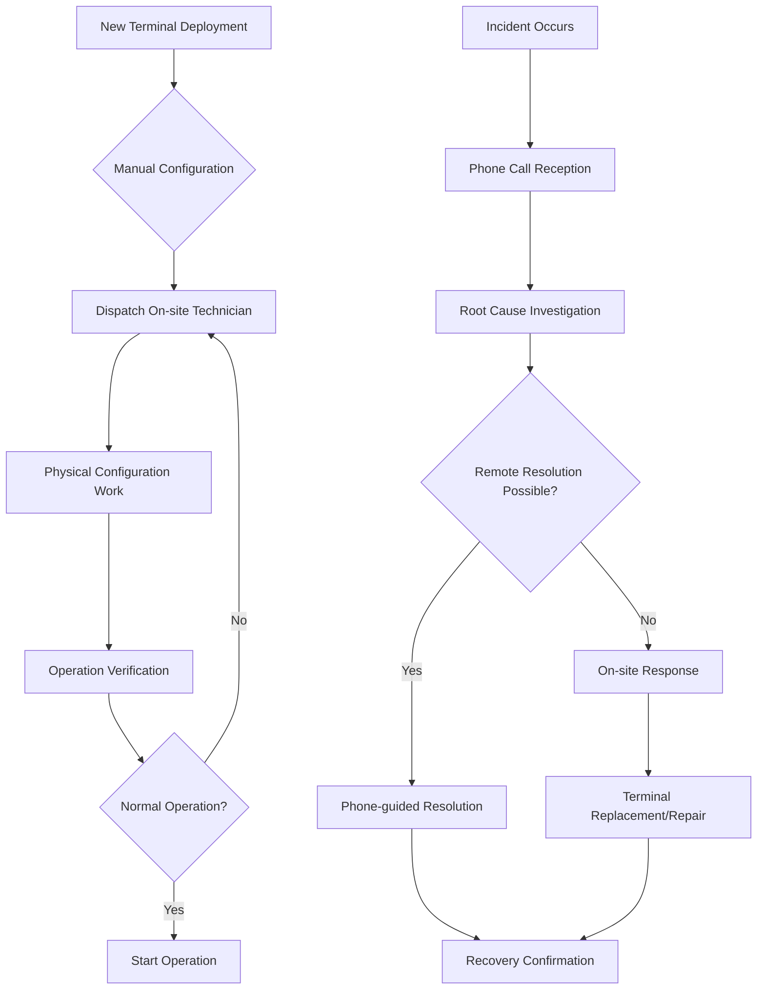
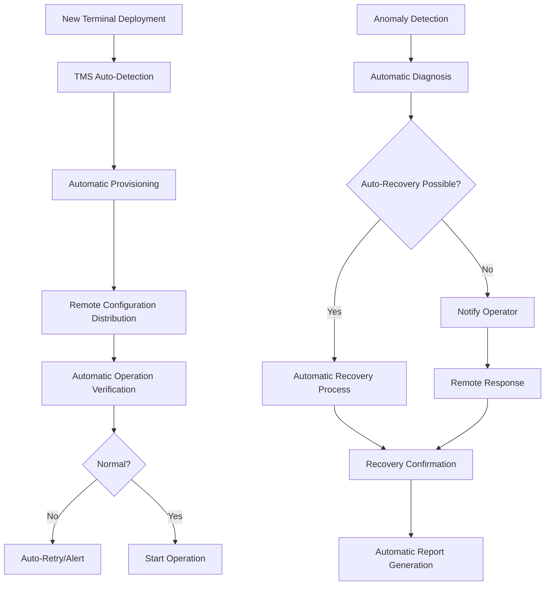
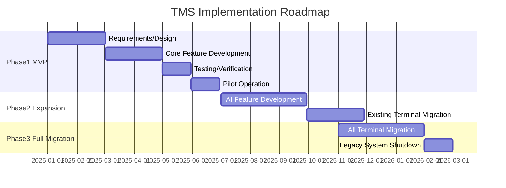

# As-Is / To-Be Business Process Analysis
## TechCore Solutions TMS Development Project

**Document Version**: 1.0
**Created Date**: November 23, 2025
**Status**: Draft

---

## 1. As-Is (Current State) Business Flow Analysis

### 1.1 Current Terminal Management Process



### 1.2 Current Issue List

| No | Business Process | Issue Description | Impact | Frequency | Improvement Priority |
|----|-----------------|-------------------|--------|-----------|---------------------|
| 1 | **Initial Terminal Setup** | On-site manual configuration required (30 min/unit) | High | High | A |
| 2 | **Firmware Updates** | On-site visit or terminal collection required | High | Medium | A |
| 3 | **Incident Response** | Root cause identification takes time (average 4 hours) | High | High | A |
| 4 | **Parameter Changes** | Individual handling, bulk changes not possible | Medium | High | B |
| 5 | **Terminal Status Monitoring** | Real-time monitoring not available | High | Constant | A |
| 6 | **Key Management** | Physical key injection work required | High | Low | B |
| 7 | **Report Creation** | Manual data collection and aggregation | Medium | Medium | C |
| 8 | **Multiple Terminal Management** | No unified management console | Medium | High | B |
| 9 | **History Management** | Work history is scattered | Low | Medium | C |
| 10 | **Cost Management** | PayConnect service fees are expensive | High | Constant | A |

### 1.3 Current Structure and Tools

| Item | Current State | Issues |
|------|--------------|--------|
| **Management Tools** | Excel + individual management systems | Not integrated, many manual tasks |
| **Monitoring Method** | Periodic manual checks | No real-time capability, risk of oversight |
| **Support Structure** | Daytime only (9-18) | Night and weekend support difficult |
| **Documentation** | Paper-based + scattered files | Poor searchability, update omissions |
| **Communication** | Phone + email | Difficult to track history, information sharing delays |

---

## 2. To-Be (Ideal State) Business Flow

### 2.1 Terminal Management Process with New System



### 2.2 To-Be Business Flow Details

#### 2.2.1 Terminal Lifecycle Management

| Phase | As-Is (Current) | To-Be (Ideal) | Improvement Effect |
|-------|-----------------|---------------|-------------------|
| **Procurement** | Manual ordering and inventory management | Demand prediction-based automatic order suggestions | Inventory optimization |
| **Initial Setup** | 30 min/unit on-site | 5 min/unit remote | 83% time reduction |
| **Distribution** | Logistics + on-site configuration | Logistics only (Plug & Play) | Zero configuration effort |
| **Operations** | Passive monitoring | Proactive monitoring | Incident prevention |
| **Updates** | On-site work | OTA automatic updates | Zero on-site work |
| **Disposal** | Manual records | Automatic disposal processing and data erasure | Enhanced security |

#### 2.2.2 Daily Operations

| Task | Frequency | As-Is | To-Be | Automation Rate |
|------|-----------|-------|-------|-----------------|
| **Health Monitoring** | Constant | Manual checks | Automatic monitoring and notification | 100% |
| **Parameter Updates** | Weekly | Individual manual | Bulk automatic distribution | 90% |
| **Log Collection** | Daily | Manual retrieval | Automatic collection and analysis | 100% |
| **Report Creation** | Monthly | Excel manual | Automatic generation | 95% |
| **Incident Response** | As needed | All manual | 70% automatic response | 70% |

### 2.3 Functional Requirements for To-Be Implementation

#### Essential Features (MVP)
1. **Automatic Terminal Registration**: Automatic registration via QR code/serial number
2. **Zero-Touch Provisioning**: Automatic configuration on power-on
3. **OTA Updates**: Remote firmware/application updates
4. **Real-Time Monitoring**: 24/7/365 automatic monitoring
5. **Basic API**: REST API for external system integration

#### Differentiated Features (Phase 2)
1. **AI Failure Prediction**: Preventive maintenance using machine learning
2. **Voice Commands**: Voice commands like "Tell me TC-200 status"
3. **Chatbot**: First-line support through automated responses
4. **AR Remote Support**: AR guidance for on-site technicians

---

## 3. Business Requirements List (BRD)

### 3.1 Functional Requirements

| ID | Category | Requirement | Priority | Notes |
|----|----------|-------------|----------|-------|
| BR-001 | Terminal Management | Must be able to manage 10,000+ terminals simultaneously | Required | Scalability is critical |
| BR-002 | Terminal Management | Must be able to remotely control all TC-200 functions | Required | - |
| BR-003 | Terminal Management | Must be able to manage other vendors' terminals in the future | High | Ensure extensibility |
| BR-004 | Monitoring | Health monitoring must be possible at 1-minute intervals | Required | - |
| BR-005 | Monitoring | Notifications must be sent within 5 minutes of anomaly | Required | SLA requirement |
| BR-006 | Updates | Firmware must be updatable without downtime | High | Blue-Green deployment |
| BR-007 | Security | Must ensure PCI DSS compliant security | Required | Compliance |
| BR-008 | Security | Remote Key Injection (RKI) must be possible | High | - |
| BR-009 | Analytics | Must be able to visualize terminal uptime | Medium | KPI management |
| BR-010 | Analytics | Must be able to analyze and predict failure trends | Medium | AI utilization |
| BR-011 | Usability | Non-technical staff must be able to perform basic operations | High | UI/UX focus |
| BR-012 | Integration | Must integrate with PayNet/CardLink | Medium | Japan market support |
| BR-013 | Multilingual | Must support Japanese/English | Required | - |
| BR-014 | Availability | Must ensure 99.9%+ uptime | Required | SLA |
| BR-015 | Performance | Screen response within 3 seconds | High | UX |

### 3.2 Non-Functional Requirements (Overview)

| Category | Requirement Level | Details |
|----------|------------------|---------|
| **Availability** | 99.9% | Annual downtime 8.76 hours or less |
| **Performance** | High-speed | - Screen display within 3 seconds<br>- API response within 1 second<br>- 1,000 concurrent users |
| **Scalability** | High | - Support 10x increase in terminals<br>- Easy feature additions |
| **Security** | Maximum | - PCI DSS compliance<br>- Encrypted communication<br>- Audit logs |
| **Maintainability** | High | - Log-based tracking<br>- Automatic backups |
| **Portability** | Medium | - Cloud-to-cloud migration possible |

---

## 4. User Stories (Key Items)

### 4.1 Operator Perspective

```
As an operations operator
I want to receive automatic notifications when anomalous terminals are detected
So that I can respond quickly and minimize impact on merchants
```

**Acceptance Criteria:**
- [ ] Detect terminal anomalies within 1 minute
- [ ] Notify via email/Slack/phone
- [ ] Display anomaly details and recommended actions
- [ ] One-click to start remote diagnostics

### 4.2 Merchant Administrator Perspective

```
As a merchant administrator
I want to check terminal status from my smartphone
So that I can understand the situation even when not at the store
```

**Acceptance Criteria:**
- [ ] Responsive UI for smartphones
- [ ] Real-time status display
- [ ] View past transaction history
- [ ] Support inquiry functionality

### 4.3 System Administrator Perspective

```
As a system administrator
I want to update firmware on multiple terminals at once
So that I can efficiently apply security patches
```

**Acceptance Criteria:**
- [ ] Terminal group selection functionality
- [ ] Schedule configuration
- [ ] Rollback functionality
- [ ] Update progress visualization

---

## 5. Improvement Effects by Business Flow

### 5.1 Quantitative Improvement Effects

| Task | As-Is | To-Be | Improvement Rate | Annual Savings |
|------|-------|-------|-----------------|----------------|
| Initial Setup | 30 min/unit | 5 min/unit | 83% | 2,500 hours |
| Incident Response | 4 hours/case | 1 hour/case | 75% | 3,000 hours |
| Monthly Report | 8 hours/month | 0.5 hours/month | 94% | 90 hours |
| Firmware Update | 60 min/unit | 5 min/unit | 92% | 5,500 hours |
| **Total Labor Savings** | - | - | - | **11,090 hours** |
| **Monetary Value** | - | - | - | **Approx. 33 million yen** |

*Assumptions: 3,000 yen/hour, 1,000 terminals managed annually, 100 incidents/year

### 5.2 Qualitative Improvement Effects

| Item | Improvement Content | Business Impact |
|------|--------------------|--------------------|
| **Customer Satisfaction** | 75% reduction in incident response time | Reduced complaints, improved contract renewal rate |
| **Employee Satisfaction** | Automation of simple tasks | Improved motivation, reduced turnover |
| **Competitiveness** | Differentiation through unique features | New customer acquisition, higher unit prices |
| **Scale** | 10x capacity through automation | Foundation for business expansion |
| **Innovation** | New services through data utilization | New revenue sources |

---

## 6. Migration Plan (As-Is to To-Be)

### 6.1 Phased Migration Approach



### 6.2 Risk Mitigation Strategies

| Risk | Countermeasures |
|------|-----------------|
| **Migration Failures** | - Phased migration<br>- Rollback procedures prepared<br>- Parallel operation period |
| **User Training** | - Pre-implementation training<br>- Manual/video creation<br>- Help desk reinforcement |
| **Data Migration** | - Pre-verification<br>- Backup secured<br>- Phased migration |

---

## 7. Success Criteria

### 7.1 Project Success Definition

| Perspective | Success Criteria | Measurement Method |
|-------------|-----------------|-------------------|
| **Cost** | 50% reduction in operating costs | Monthly cost comparison |
| **Quality** | 50% reduction in incident rate | Incident management |
| **Schedule** | Production launch by December 2025 | Project management |
| **Satisfaction** | User satisfaction 80%+ | Survey |

### 7.2 Completion Criteria for Each Phase

#### Phase 1 (MVP) Completion Criteria
- [ ] Basic functionality implementation complete
- [ ] Operation verification on TC-200
- [ ] Load test passed with 100 units
- [ ] Security audit passed

#### Phase 2 Completion Criteria
- [ ] AI functionality implementation complete
- [ ] Operation confirmed with 1,000 units
- [ ] Support for one other vendor's terminal

#### Phase 3 Completion Criteria
- [ ] All terminal migration complete
- [ ] Legacy system shutdown
- [ ] Operations handover complete

---

## 8. Next Actions

1. [DONE] As-Is/To-Be analysis complete
2. [ ] Stakeholder review
3. [ ] Detail functional requirements
4. [ ] Begin screen design
5. [ ] Data model design

---

## Revision History

| Version | Date | Changes | Author |
|---------|------|---------|--------|
| 1.0 | 2025/11/23 | Initial version | Claude Code |
