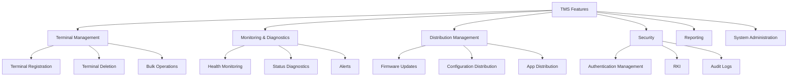
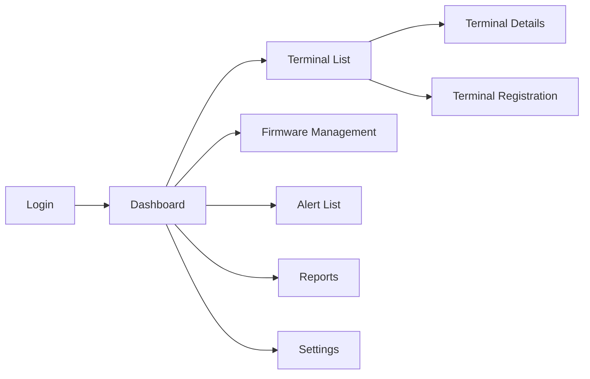

# Functional Requirements Specification
## TechCore Solutions TMS

**Document Version**: 1.0
**Created Date**: November 23, 2025
**Development Scale**: 1 developer, 10,000 terminal support

---

## 1. Feature List (Prioritized)

### 1.1 Feature Map



### 1.2 Implementation Priority Matrix

| Priority | Feature Category | Feature Details | Implementation Timing |
|----------|-----------------|-----------------|----------------------|
| **P0: Required** | Terminal Management | Terminal registration, deletion, list | Phase 1 (Month 1) |
| **P0: Required** | Monitoring | Health monitoring (online/offline) | Phase 1 (Month 1) |
| **P0: Required** | System | User authentication and authorization | Phase 1 (Month 1) |
| **P1: Important** | Distribution | Firmware OTA updates | Phase 2 (Month 2) |
| **P1: Important** | Distribution | Bulk parameter configuration | Phase 2 (Month 2) |
| **P1: Important** | Monitoring | Alert notifications (email) | Phase 2 (Month 2) |
| **P2: Recommended** | Reporting | Basic reports (uptime, etc.) | Phase 3 (Month 3) |
| **P2: Recommended** | Diagnostics | Remote diagnostics feature | Phase 3 (Month 3) |
| **P2: Recommended** | Monitoring | Auto-recovery feature | Phase 3 (Month 3) |
| **P3: Future** | Security | Remote Key Injection (RKI) | Phase 4 (Month 4) |
| **P3: Future** | API | External system integration API | Phase 4 (Month 4) |
| **P3: Future** | Analytics | AI predictive maintenance | Phase 5 (Month 6) |

---

## 2. Detailed Feature Specifications

### 2.1 Terminal Management Features (P0: Required)

#### FR-001: Terminal Registration

**Overview**: Register a new terminal in TMS

**Input**:
- Serial number (required, unique)
- Model (default: TC-200)
- Installation location (optional)
- Responsible person (optional)

**Processing**:
1. Check for duplicate serial number
2. Register in database
3. Set initial status to "Disconnected"
4. Send registration completion notification

**Output**:
- Registration success/failure message
- Terminal ID

**Implementation Sample (Django)**:
```python
# models.py
class Terminal(models.Model):
    serial_number = models.CharField(max_length=50, unique=True)
    model = models.CharField(max_length=20, default='TC-200')
    location = models.CharField(max_length=200, blank=True)
    responsible_person = models.CharField(max_length=100, blank=True)
    status = models.CharField(max_length=20, default='disconnected')
    created_at = models.DateTimeField(auto_now_add=True)

# views.py
def register_terminal(request):
    if request.method == 'POST':
        serial = request.POST.get('serial_number')
        # Duplicate check
        if Terminal.objects.filter(serial_number=serial).exists():
            return JsonResponse({'error': 'Already registered'}, status=400)

        terminal = Terminal.objects.create(
            serial_number=serial,
            model=request.POST.get('model', 'TC-200'),
            location=request.POST.get('location', ''),
        )
        return JsonResponse({'id': terminal.id, 'message': 'Registration complete'})
```

#### FR-002: Terminal List Display

**Overview**: Display list of registered terminals

**Filter Conditions**:
- Status (online/offline/error)
- Model
- Installation location
- Search (serial number)

**Display Items**:
- Serial number
- Status
- Last communication time
- Firmware version
- Installation location

**Pagination**: 100 items/page

#### FR-003: Terminal Deletion

**Overview**: Soft delete terminal (preserve history)

**Permission**: Administrators only

---

### 2.2 Monitoring Features (P0: Required)

#### FR-010: Health Monitoring

**Overview**: Perform regular health checks on terminals

**Monitoring Interval**:
- Normal: 5 minutes
- Critical terminals: 1 minute

**Status Definitions**:
| Status | Condition |
|--------|-----------|
| Online | Last communication within 5 minutes |
| Offline | Last communication over 5 minutes ago |
| Error | Error response received |
| Maintenance | Manually configured |

**Implementation Sample (Scheduled Task)**:
```python
# tasks.py (Celery)
from celery import shared_task
from datetime import datetime, timedelta

@shared_task
def check_terminal_health():
    # Detect terminals with no communication for 5+ minutes
    threshold = datetime.now() - timedelta(minutes=5)
    offline_terminals = Terminal.objects.filter(
        last_seen__lt=threshold,
        status='online'
    )

    for terminal in offline_terminals:
        terminal.status = 'offline'
        terminal.save()
        # Send alert
        send_alert.delay(terminal.id, 'Offline detected')

    return f'{offline_terminals.count()} terminals are offline'
```

#### FR-011: Alert Notifications

**Trigger Conditions**:
- Transition to offline
- Error occurrence
- Firmware update failure
- Threshold exceeded (CPU/memory)

**Notification Methods**:
- Phase 1: Email
- Phase 2: Slack
- Phase 3: SMS

---

### 2.3 Distribution Management Features (P1: Important)

#### FR-020: Firmware Updates

**Overview**: Update firmware via OTA (Over-The-Air)

**Update Flow**:
```
1. Upload update file
2. Select target terminals (individual/group/all)
3. Configure schedule (immediate/scheduled)
4. Execute distribution
5. Monitor progress
6. Confirm results
```

**Implementation Key Points**:
```python
# models.py
class FirmwareUpdate(models.Model):
    version = models.CharField(max_length=20)
    file = models.FileField(upload_to='firmware/')
    checksum = models.CharField(max_length=64)  # SHA256
    created_at = models.DateTimeField(auto_now_add=True)

class UpdateTask(models.Model):
    firmware = models.ForeignKey(FirmwareUpdate, on_delete=models.CASCADE)
    terminal = models.ForeignKey(Terminal, on_delete=models.CASCADE)
    status = models.CharField(max_length=20)  # pending/downloading/installing/completed/failed
    started_at = models.DateTimeField(null=True)
    completed_at = models.DateTimeField(null=True)
    error_message = models.TextField(blank=True)
```

#### FR-021: Parameter Configuration

**Configurable Items**:
- Communication interval
- Server URL
- Timeout values
- Log level
- Other terminal-specific settings

**Distribution Methods**:
- Individual configuration
- Template application
- Bulk update

---

### 2.4 Security Features (P2-P3)

#### FR-030: User Authentication and Authorization

**User Roles**:

| Role | Permissions |
|------|-------------|
| Administrator | All features |
| Operator | Monitoring and basic operations |
| Viewer | Read-only |

**Implementation**: Use Django standard authentication

```python
# views.py
from django.contrib.auth.decorators import login_required, permission_required

@login_required
@permission_required('terminals.change_terminal')
def update_terminal(request, terminal_id):
    # Execute only if authorized
    pass
```

#### FR-031: Audit Logs

**Recorded Items**:
- Who (user)
- When (timestamp)
- What (operation content)
- Target (terminal ID, etc.)
- Result (success/failure)

#### FR-032: Remote Key Injection (RKI) - Phase 4

**Overview**: Securely distribute encryption keys remotely

---

### 2.5 Reporting Features (P2: Recommended)

#### FR-040: Dashboard

**Display Items**:
```
+----------------------------------+
|  Total Terminals: 10,000          |
|  +------+ +------+ +------+      |
|  |Online| |Offline| |Error |      |
|  | 9,500| |  450 | |  50  |      |
|  +------+ +------+ +------+      |
|                                   |
|  Uptime: 95.0%                    |
|  Alerts: 5                        |
+----------------------------------+
```

#### FR-041: Scheduled Reports

**Report Types**:
- Daily: Operational statistics
- Weekly: Incident summary
- Monthly: Detailed analysis

**Output Formats**:
- Screen display
- PDF
- CSV

---

## 3. Screen Design

### 3.1 Screen List

| ID | Screen Name | URL | Description |
|----|-------------|-----|-------------|
| S01 | Login | /login | User authentication |
| S02 | Dashboard | /dashboard | Overview display |
| S03 | Terminal List | /terminals | Terminal list |
| S04 | Terminal Details | /terminals/{id} | Individual details |
| S05 | Terminal Registration | /terminals/new | New registration |
| S06 | Firmware Management | /firmware | Update management |
| S07 | Alert List | /alerts | Notification confirmation |
| S08 | Reports | /reports | Various reports |
| S09 | Settings | /settings | System settings |

### 3.2 Screen Transition Diagram



### 3.3 Responsive Support

- PC: Full features
- Tablet: Main features
- Smartphone: Monitoring and viewing only

---

## 4. API Specification (Phase 4)

### 4.1 Endpoint List

| Method | Path | Description |
|--------|------|-------------|
| GET | /api/v1/terminals | Get terminal list |
| GET | /api/v1/terminals/{id} | Get terminal details |
| POST | /api/v1/terminals | Register terminal |
| PUT | /api/v1/terminals/{id} | Update terminal |
| DELETE | /api/v1/terminals/{id} | Delete terminal |
| POST | /api/v1/terminals/{id}/reboot | Issue reboot command |
| GET | /api/v1/terminals/{id}/logs | Get logs |

### 4.2 Authentication Method

- Token authentication (Django REST Framework Token)
- Future: OAuth 2.0

---

## 5. Data Flow

### 5.1 Terminal to TMS Communication

```
Terminal --HTTPS--> TMS
    |
    JSON {
        "serial": "TC-200-001",
        "timestamp": "2025-01-01T12:00:00Z",
        "status": "online",
        "metrics": {
            "cpu": 45,
            "memory": 60,
            "disk": 30
        }
    }
```

### 5.2 TMS to Terminal Commands

```
TMS --HTTPS--> Terminal
    |
    JSON {
        "command": "update_firmware",
        "parameters": {
            "version": "2.0.0",
            "url": "https://tms.example.com/firmware/2.0.0.bin",
            "checksum": "abc123..."
        }
    }
```

---

## 6. Error Handling

### 6.1 Error Code System

| Code | Meaning | Action |
|------|---------|--------|
| E001 | Communication timeout | Auto-retry |
| E002 | Authentication failure | Manual check required |
| E003 | Data inconsistency | Log and notify |
| E004 | Insufficient capacity | Send alert |
| E005 | Invalid firmware | Abort update |

### 6.2 Retry Strategy

```python
# Retry with exponential backoff
import time

def retry_with_backoff(func, max_retries=3):
    for i in range(max_retries):
        try:
            return func()
        except Exception as e:
            if i == max_retries - 1:
                raise
            wait_time = 2 ** i  # 1, 2, 4 seconds
            time.sleep(wait_time)
```

---

## 7. Performance Requirements

### 7.1 Response Time

| Operation | Target Time | Maximum Allowed |
|-----------|-------------|-----------------|
| Login | 1 second | 3 seconds |
| List display (100 items) | 2 seconds | 5 seconds |
| Detail display | 1 second | 3 seconds |
| Update processing | 3 seconds | 10 seconds |

### 7.2 Concurrent Connections

- Management console: 100 users
- Terminal communication: 10,000 units
- API: 1,000 req/sec

---

## 8. Detailed Implementation Roadmap

### Month 1: Foundation Building
- [ ] Week 1-2: Django learning and environment setup
- [ ] Week 3: Terminal model and admin panel
- [ ] Week 4: Basic list and detail screens

### Month 2: Core Features
- [ ] Week 5-6: Health monitoring implementation
- [ ] Week 7-8: Firmware update feature

### Month 3: Operational Features
- [ ] Week 9-10: Alerts and notifications
- [ ] Week 11-12: Reporting features

### Month 4-6: Extensions
- [ ] API development
- [ ] Security hardening
- [ ] Performance optimization

---

## Revision History

| Version | Date | Changes |
|---------|------|---------|
| 1.0 | 2025/11/23 | Initial version |
