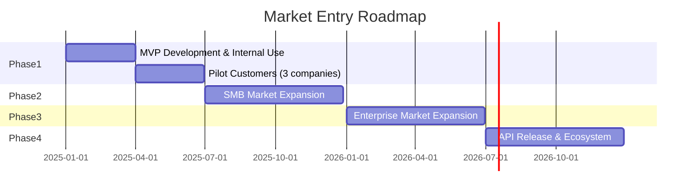

# TMS Business Model Analysis
## Recommended Strategy for TechCore Solutions

**Created**: November 23, 2025

---

## 1. Recommended Business Model: Multi-tenant SaaS

### 1.1 Basic Structure

```
┌─────────────────────────────────────┐
│         TechCore TMS                │
│      (Multi-tenant Support)         │
├──────────┬──────────┬──────────────┤
│ Tenant A │ Tenant B │ Tenant C     │
│ (Large)  │ (Medium) │ (Small)      │
└──────────┴──────────┴──────────────┘
```

### 1.2 Customer Segment Approach

| Segment | Company Size | Terminal Count | Service Type | Pricing Model |
|---------|-------------|----------------|--------------|---------------|
| **Enterprise** | Large Chains | 100+ units | Dedicated environment + Customization | Annual License |
| **Mid-market** | Mid-size Companies | 20-100 units | Shared environment + Configuration | Monthly Usage-based |
| **Small Business** | Individual Stores | 1-20 units | Shared environment + Standard Features | Monthly Flat Rate |
| **Support Contract** | All Sizes | - | Remote Support | Per-incident Billing |

---

## 2. System Architecture

### 2.1 Multi-tenant Design

```python
# models.py - Multi-tenant support
from django.db import models

class Company(models.Model):
    """Customer company (tenant)"""
    name = models.CharField(max_length=100)
    plan = models.CharField(
        max_length=20,
        choices=[
            ('enterprise', 'Enterprise'),
            ('standard', 'Standard'),
            ('basic', 'Basic'),
        ]
    )
    max_terminals = models.IntegerField()  # Maximum contracted terminals
    contract_start = models.DateField()
    contract_end = models.DateField()
    is_active = models.BooleanField(default=True)

class Terminal(models.Model):
    """Terminal (linked to company)"""
    company = models.ForeignKey(Company, on_delete=models.CASCADE)
    serial_number = models.CharField(max_length=50)
    store_name = models.CharField(max_length=100)
    # ... other fields

class TMSUser(models.Model):
    """User (linked to company)"""
    company = models.ForeignKey(Company, on_delete=models.CASCADE)
    user = models.OneToOneField('auth.User', on_delete=models.CASCADE)
    role = models.CharField(
        max_length=20,
        choices=[
            ('admin', 'Administrator'),
            ('operator', 'Operator'),
            ('viewer', 'Viewer'),
        ]
    )
```

### 2.2 Data Isolation Mechanism

```python
# views.py - Tenant-specific data isolation
from django.contrib.auth.decorators import login_required

@login_required
def terminal_list(request):
    # Identify logged-in user's company
    user_company = request.user.tmsuser.company

    # Display only that company's terminals
    terminals = Terminal.objects.filter(company=user_company)

    return render(request, 'terminal_list.html', {
        'terminals': terminals,
        'company': user_company
    })
```

---

## 3. Pricing Structure Proposal

### 3.1 Basic Plans

| Plan | Monthly Base Fee | Included Terminals | Additional Terminals | Features |
|------|-----------------|-------------------|---------------------|----------|
| **Basic** | ¥10,000 | Up to 10 | ¥1,000/unit | Basic features only |
| **Standard** | ¥30,000 | Up to 50 | ¥800/unit | + Reports & API |
| **Enterprise** | ¥100,000 | Up to 200 | ¥500/unit | + Customization & Priority Support |

### 3.2 Optional Services

| Service | Price | Description |
|---------|-------|-------------|
| **24/7 Monitoring** | ¥20,000/month | Automated response during incidents |
| **On-site Support** | ¥50,000/visit | On-site configuration & repair |
| **Custom Development** | Quote required | Customer-specific feature development |
| **Data Analysis Reports** | ¥10,000/month | Monthly analysis report delivery |

---

## 4. Competitive Differentiation Strategy

### 4.1 TechCore's Strengths

| Item | TechCore Advantage | Implementation Method |
|------|-------------------|----------------------|
| **Hardware Integration** | Deep integration with TC-200 | Dedicated API, firmware integration |
| **Domestic Support** | Full Japanese language support | Domestic support center |
| **Customizability** | Understanding of Japanese market needs | Flexible feature additions |
| **Price Competitiveness** | Low cost through in-house development | 50% cheaper than PayConnect, etc. |

### 4.2 Phased Market Entry Strategy



---

## 5. Revenue Simulation

### 5.1 Customer Acquisition Scenario

| Timeline | Basic | Standard | Enterprise | Monthly Revenue | Annual Revenue |
|----------|-------|----------|------------|-----------------|----------------|
| 6 months | 10 companies | 3 companies | 0 companies | ¥190,000 | - |
| 1 year | 30 companies | 10 companies | 2 companies | ¥800,000 | ¥9,600,000 |
| 2 years | 50 companies | 20 companies | 5 companies | ¥1,600,000 | ¥19,200,000 |
| 3 years | 80 companies | 35 companies | 10 companies | ¥2,850,000 | ¥34,200,000 |

### 5.2 Break-even Point

- **Initial Investment**: Development cost ¥5 million (6 months of personnel costs)
- **Monthly Operating Cost**: ¥100,000 (AWS, support personnel)
- **Break-even Point**: Monthly revenue ¥500,000 (approximately 30 customers)
- **Expected Achievement**: 8-10 months

---

## 6. Risks and Countermeasures

| Risk | Impact | Countermeasures |
|------|--------|-----------------|
| **Customer Data Breach** | Critical | - Data encryption<br>- Access control<br>- Audit logs |
| **System Failure** | High | - Redundancy<br>- Auto-failover<br>- SLA agreement |
| **Competitive Entry** | Medium | - Feature differentiation<br>- Customer lock-in<br>- Price advantage |
| **Regulatory Changes** | Medium | - Compliance framework<br>- Flexible design |

---

## 7. Implementation Priority (Multi-tenant Support)

### Phase 1: Single-tenant Version (3 months)
- Implement basic features for one company
- Validate with internal or pilot customer

### Phase 2: Multi-tenant Migration (2 months)
- Add data isolation features
- Strengthen permission management
- Billing system integration

### Phase 3: Self-service Implementation (2 months)
- Customer self-registration of terminals
- Online support
- Usage dashboard

---

## 8. Items Requiring Decision

### Urgent Decisions Required

1. **Target Market**
   - [ ] SMB-focused (volume-oriented)
   - [ ] Enterprise-focused (value-oriented)
   - [ ] Both (recommended)

2. **Initial Release Format**
   - [ ] Limited customer pilot
   - [ ] Start with internal use
   - [ ] Immediate public release

3. **Pricing Model**
   - [ ] Monthly subscription (recommended)
   - [ ] Annual license
   - [ ] One-time purchase + maintenance fee

### Can Be Decided Later

- Brand name
- Marketing strategy
- Partner strategy

---

## 9. Action Plan

### This Week
1. Internal approval of business model
2. List pilot customer candidates
3. Finalize MVP features

### This Month
1. Start prototype development
2. Align requirements with pilot customers
3. Detailed pricing design

### 3-Month Goals
- Pilot version operational
- Start proof of concept with 3 companies
- Collect feedback and improve

---

## Conclusion

**Recommended Direction**:
- Develop as **Multi-tenant SaaS**
- Start with **SMBs** and gradually expand to enterprises
- Secure stable revenue with **monthly subscription model**

This enables a transition from paying service fees like PayConnect to **generating revenue by providing services**.
