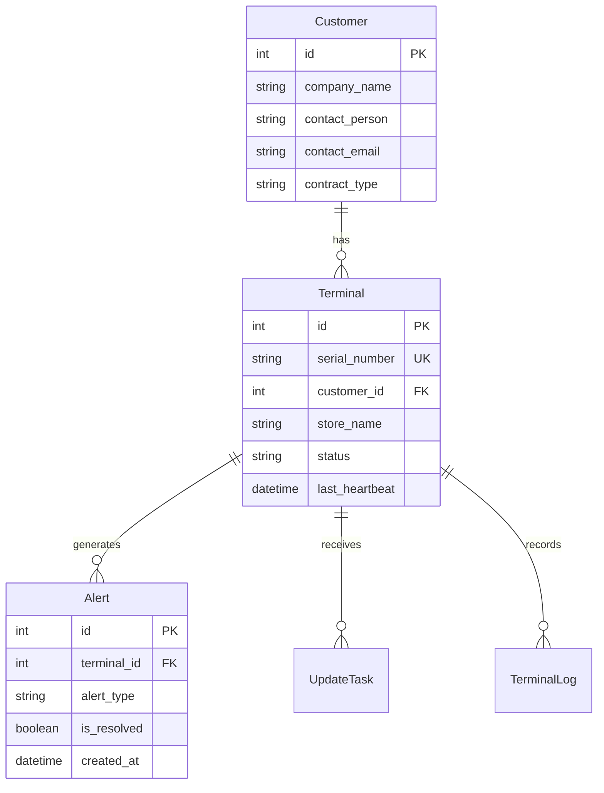
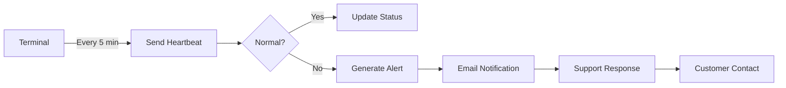
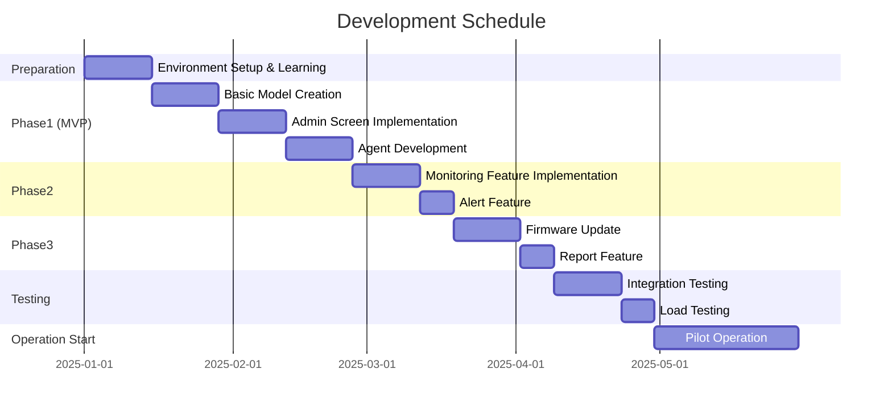

# TMS System Architecture Design Document (Final Version)
## TechCore Solutions Terminal Management System

**Document Version**: 1.0
**Created**: November 23, 2025
**Operation Model**: Centralized Management by TechCore

---

## 1. System Overview

### 1.1 Basic Policy
- **Operating Entity**: TechCore Solutions Support Team
- **Managed Assets**: All customer TC-200 terminals (10,000 unit scale)
- **Users**: TechCore internal operations team (5-10 people)
- **Customer Involvement**: Incident reporting only (no direct operation)

### 1.2 System Configuration Diagram

```
┌──────────────────────────────────────────────┐
│         TechCore Solutions HQ                │
│                                              │
│  ┌──────────────┐    ┌──────────────┐       │
│  │ TMS Admin    │    │  Support     │       │
│  │  (Django)    │←──→│   Team       │       │
│  └──────────────┘    └──────────────┘       │
│         ↑                                    │
└─────────┼────────────────────────────────────┘
          │ HTTPS (AWS)
          │
    ┌─────┴─────────────────────┐
    │                           │
┌───┴────┐  ┌────┴────┐  ┌────┴────┐
│Customer│  │Customer │  │Customer │
│   A    │  │   B     │  │   C     │
│        │  │         │  │         │
│TC-200  │  │TC-200   │  │TC-200   │
│↓USB    │  │↓USB     │  │↓USB     │
│Store PC│  │Store PC │  │Store PC │
│(Agent) │  │(Agent)  │  │(Agent)  │
└────────┘  └─────────┘  └─────────┘
```

---

## 2. Data Design (Simplified Version)

### 2.1 Main Table Design

```python
# models.py - With customer management functionality

from django.db import models

class Customer(models.Model):
    """Customer company master (TC-200 sales destinations)"""
    company_name = models.CharField(max_length=100, verbose_name='Company Name')
    contact_person = models.CharField(max_length=50, verbose_name='Contact Person')
    contact_email = models.EmailField(verbose_name='Contact Email')
    contact_phone = models.CharField(max_length=20, verbose_name='Phone Number')
    contract_type = models.CharField(
        max_length=20,
        choices=[
            ('basic', 'Basic Maintenance'),
            ('standard', 'Standard Maintenance'),
            ('premium', 'Premium Maintenance'),
        ],
        default='basic',
        verbose_name='Contract Type'
    )
    created_at = models.DateTimeField(auto_now_add=True)

    class Meta:
        verbose_name = 'Customer Company'
        verbose_name_plural = 'Customer Companies'

    def __str__(self):
        return self.company_name


class Terminal(models.Model):
    """Terminal master"""
    serial_number = models.CharField(
        max_length=50,
        unique=True,
        verbose_name='Serial Number'
    )
    customer = models.ForeignKey(
        Customer,
        on_delete=models.CASCADE,
        related_name='terminals',
        verbose_name='Customer Company'
    )
    store_name = models.CharField(
        max_length=100,
        verbose_name='Installation Store Name',
        help_text='Example: XX Store Register 1'
    )
    status = models.CharField(
        max_length=20,
        choices=[
            ('online', 'Online'),
            ('offline', 'Offline'),
            ('error', 'Error'),
            ('maintenance', 'Under Maintenance'),
        ],
        default='offline',
        verbose_name='Status'
    )
    firmware_version = models.CharField(
        max_length=20,
        default='1.0.0',
        verbose_name='Firmware'
    )
    last_heartbeat = models.DateTimeField(
        null=True,
        blank=True,
        verbose_name='Last Communication'
    )
    installed_date = models.DateField(
        null=True,
        blank=True,
        verbose_name='Installation Date'
    )

    # Meta information
    cpu_usage = models.IntegerField(default=0)
    memory_usage = models.IntegerField(default=0)
    disk_usage = models.IntegerField(default=0)

    created_at = models.DateTimeField(auto_now_add=True)
    updated_at = models.DateTimeField(auto_now=True)

    class Meta:
        verbose_name = 'Terminal'
        verbose_name_plural = 'Terminals'
        ordering = ['customer', 'store_name']

    def __str__(self):
        return f'{self.serial_number} ({self.customer.company_name} - {self.store_name})'


class Alert(models.Model):
    """Alert (incident notification)"""
    terminal = models.ForeignKey(
        Terminal,
        on_delete=models.CASCADE,
        related_name='alerts'
    )
    alert_type = models.CharField(
        max_length=20,
        choices=[
            ('offline', 'Offline'),
            ('error', 'Error'),
            ('high_cpu', 'High CPU Usage'),
            ('high_memory', 'High Memory Usage'),
            ('update_failed', 'Update Failed'),
        ],
        verbose_name='Alert Type'
    )
    message = models.TextField(verbose_name='Detailed Message')
    is_resolved = models.BooleanField(default=False, verbose_name='Resolved')
    created_at = models.DateTimeField(auto_now_add=True)
    resolved_at = models.DateTimeField(null=True, blank=True)
    resolved_by = models.CharField(max_length=50, blank=True)

    class Meta:
        verbose_name = 'Alert'
        verbose_name_plural = 'Alerts'
        ordering = ['-created_at']
```

### 2.2 ER Diagram



---

## 3. Screen Design (For TechCore Operations Team)

### 3.1 Screen List

| No | Screen Name | URL | Description | Primary Users |
|----|-------------|-----|-------------|---------------|
| 1 | Login | /login | Authentication screen | All |
| 2 | Dashboard | /dashboard | Overall status overview | Operations Team |
| 3 | Customer List | /customers | Customer management | Administrator |
| 4 | Terminal List | /terminals | Terminal status check | Operations Team |
| 5 | Alert List | /alerts | Incident response | Support |
| 6 | Terminal Details | /terminals/{id} | Individual diagnostics | Support |
| 7 | Firmware Management | /firmware | Update management | Administrator |
| 8 | Reports | /reports | Monthly reports | Administrator |

### 3.2 Dashboard Screen Image

```
┌────────────────────────────────────────────────┐
│  TMS Dashboard                  [Tanaka] Logout │
├────────────────────────────────────────────────┤
│                                                │
│  ┌──────────┐ ┌──────────┐ ┌──────────┐       │
│  │ Total    │ │ Online   │ │ Alerts   │       │
│  │ Terminals│ │          │ │          │       │
│  │  10,234  │ │   9,876  │ │    15    │       │
│  └──────────┘ └──────────┘ └──────────┘       │
│                                                │
│  Uptime: 96.5%  [=============  ]             │
│                                                │
│  [Critical Alerts]                             │
│  ⚠ ABC Corp - Shinjuku Store: Offline (10m ago)│
│  ⚠ XYZ Shop - Shibuya Store: CPU 90% (5m ago) │
│                                                │
│  [Customer Status]                             │
│  ┌─────────────────────────────────────┐      │
│  │ Customer    │Terminals│Online│Errors│      │
│  ├─────────────────────────────────────┤      │
│  │ ABC Corp    │ 523    │  520 │  1   │      │
│  │ XYZ Shop    │ 312    │  310 │  2   │      │
│  │ Tanaka Store│  89    │   89 │  0   │      │
│  └─────────────────────────────────────┘      │
└────────────────────────────────────────────────┘
```

---

## 4. Operation Flow

### 4.1 Daily Operations



### 4.2 Incident Response Flow

| Step | Action | Responsible | Time Target |
|------|--------|-------------|-------------|
| 1 | Alert Detection | System | Immediate |
| 2 | Initial Verification | Operations Team | Within 5 min |
| 3 | Remote Diagnostics | Operations Team | Within 15 min |
| 4 | Customer Contact | Support | Within 30 min |
| 5 | Execute Response | Operations Team | Within 1 hour |
| 6 | Completion Report | Support | Immediately after |

---

## 5. Security Design

### 5.1 Access Control

```python
# Accessible only from TechCore internal network
ALLOWED_HOSTS = ['tms.techcore-internal.jp']

# IP address restrictions
ALLOWED_IPS = [
    '203.0.113.0/24',  # TechCore HQ
    '198.51.100.0/24', # TechCore Data Center
]

# User permissions
class TMSUser(models.Model):
    ROLE_CHOICES = [
        ('admin', 'System Administrator'),     # All functions
        ('operator', 'Operations Operator'),   # Monitoring & basic operations
        ('support', 'Support Staff'),          # View & customer response
        ('viewer', 'View Only'),               # Report viewing
    ]
```

### 5.2 Communication Security

- Agent to TMS: HTTPS required
- Authentication: Token authentication (unique token per terminal)
- Logging: All operations recorded

---

## 6. Non-functional Requirements

### 6.1 Performance Requirements

| Item | Requirement | Notes |
|------|-------------|-------|
| Concurrent managed terminals | 10,000+ units | Expandable to 20,000 units |
| Concurrent agent connections | 10,000 | Communication at 5-minute intervals |
| Screen response | Within 3 seconds | Including list display |
| Data retention period | 1 year | Logs and history data |

### 6.2 Availability Requirements

- Service uptime: 99.5% (up to 43 minutes downtime per month)
- Backup: Daily
- Disaster recovery: Within 24 hours

---

## 7. Development Schedule (Single Developer Assumption)



---

## 8. Cost Comparison

### 8.1 PayConnect Usage vs In-house Development

| Item | PayConnect Usage (Current) | In-house Development | Reduction |
|------|---------------------------|---------------------|-----------|
| Initial Cost | ¥2 million | ¥5 million (development) | - |
| Monthly Cost | ¥100,000/month | ¥23,000/month (AWS) | 77% |
| Annual Cost | ¥1.2 million/year | ¥276,000/year | 77% |
| 3-Year Total | ¥5.6 million | ¥5.828 million | -4% |
| 5-Year Total | ¥8 million | ¥6.38 million | 20% |

**Break-even Point**: Approximately 3 years (recover development costs)

### 8.2 Additional Revenue Potential

By having in-house TMS:
- Increased value of maintenance services
- Room for maintenance fee increases (potential ¥10 million/year increase)
- Differentiation for new customer acquisition

---

## 9. Risks and Countermeasures

| Risk | Impact | Countermeasures |
|------|--------|-----------------|
| Single developer limitations | High | - Phased development<br>- Consider outsourcing<br>- Utilize existing tools |
| Security incident | High | - Use standard features<br>- Regular audits<br>- Insurance |
| Performance issues | Medium | - Cloud utilization<br>- Cache usage<br>- CDN implementation |

---

## 10. Definition of Success

### Short-term (6 months)
- Stable operation with 100 units
- Basic feature implementation complete
- Begin migration from PayConnect

### Medium-term (1 year)
- Operation with 1,000 units
- Achieve 50% operating cost reduction
- 50% reduction in incident response time

### Long-term (2 years)
- Full operation with 10,000 units
- Achieve profitability
- Expansion to next-generation products

---

## Summary

This TMS is:
- A system for **TechCore to centrally manage all customer terminals**
- **Customers do not directly operate** (through support)
- **Simple design** that one person can develop
- **ROI in 3 years**, 20% cost reduction in 5 years

Next Actions:
1. Django environment setup
2. Basic model creation
3. Admin screen implementation
