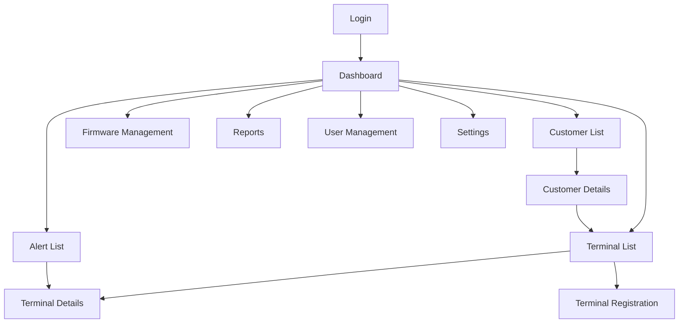

# Screen Detailed Specification Document
## TechCore Solutions TMS

**Document Version**: 1.0
**Created**: November 24, 2025
**Target**: Devin Auto-implementation

---

## 1. Screen List and Navigation

### 1.1 Screen List

| ID | Screen Name | URL | File Name | Permission |
|----|-------------|-----|-----------|------------|
| SC001 | Login | /login | login.html | All |
| SC002 | Dashboard | /dashboard | dashboard.html | All (login required) |
| SC003 | Terminal List | /terminals | terminal_list.html | All |
| SC004 | Terminal Details | /terminals/{id} | terminal_detail.html | All |
| SC005 | Terminal Registration | /terminals/new | terminal_new.html | admin, operator |
| SC006 | Customer List | /customers | customer_list.html | admin, operator |
| SC007 | Customer Details | /customers/{id} | customer_detail.html | admin, operator |
| SC008 | Alert List | /alerts | alert_list.html | All |
| SC009 | Firmware Management | /firmware | firmware_list.html | admin |
| SC010 | Reports | /reports | report.html | admin, operator |
| SC011 | User Management | /users | user_list.html | admin |
| SC012 | Settings | /settings | settings.html | admin |

### 1.2 Screen Navigation Diagram



---

## 2. Common Specifications

### 2.1 Layout Structure

```html
<!DOCTYPE html>
<html lang="en">
<head>
    <meta charset="UTF-8">
    <meta name="viewport" content="width=device-width, initial-scale=1.0">
    <title>TMS - {Page Title}</title>
    <link href="https://cdn.jsdelivr.net/npm/bootstrap@5.3.0/dist/css/bootstrap.min.css" rel="stylesheet">
    <link href="/static/css/style.css" rel="stylesheet">
</head>
<body>
    <!-- Header -->
    <nav class="navbar navbar-expand-lg navbar-dark bg-primary">
        <div class="container-fluid">
            <a class="navbar-brand" href="/dashboard">
                
                TMS
            </a>
            <div class="navbar-nav ms-auto">
                <span class="navbar-text me-3">
                    {Username} ({Role})
                </span>
                <a class="btn btn-outline-light btn-sm" href="/logout">Logout</a>
            </div>
        </div>
    </nav>

    <!-- Sidebar + Main Content -->
    <div class="container-fluid">
        <div class="row">
            <!-- Sidebar -->
            <nav class="col-md-2 bg-light sidebar">
                <div class="position-sticky pt-3">
                    <ul class="nav flex-column">
                        <li class="nav-item">
                            <a class="nav-link" href="/dashboard">
                                <i class="bi bi-speedometer2"></i> Dashboard
                            </a>
                        </li>
                        <li class="nav-item">
                            <a class="nav-link" href="/terminals">
                                <i class="bi bi-pc-display"></i> Terminal Management
                            </a>
                        </li>
                        <li class="nav-item">
                            <a class="nav-link" href="/customers">
                                <i class="bi bi-building"></i> Customer Management
                            </a>
                        </li>
                        <li class="nav-item">
                            <a class="nav-link" href="/alerts">
                                <i class="bi bi-bell"></i> Alerts
                                <span class="badge bg-danger">5</span>
                            </a>
                        </li>
                        <li class="nav-item">
                            <a class="nav-link" href="/firmware">
                                <i class="bi bi-download"></i> Firmware
                            </a>
                        </li>
                        <li class="nav-item">
                            <a class="nav-link" href="/reports">
                                <i class="bi bi-graph-up"></i> Reports
                            </a>
                        </li>
                        <li class="nav-item">
                            <a class="nav-link" href="/users">
                                <i class="bi bi-people"></i> User Management
                            </a>
                        </li>
                        <li class="nav-item">
                            <a class="nav-link" href="/settings">
                                <i class="bi bi-gear"></i> Settings
                            </a>
                        </li>
                    </ul>
                </div>
            </nav>

            <!-- Main Content -->
            <main class="col-md-10 ms-sm-auto px-md-4">
                {Content}
            </main>
        </div>
    </div>

    <!-- Footer -->
    <footer class="footer mt-auto py-3 bg-light">
        <div class="container text-center">
            <span class="text-muted">© 2025 TechCore Solutions</span>
        </div>
    </footer>

    <script src="https://cdn.jsdelivr.net/npm/bootstrap@5.3.0/dist/js/bootstrap.bundle.min.js"></script>
    <script src="/static/js/app.js"></script>
</body>
</html>
```

### 2.2 Color Scheme

| Element | Color | HEX Code | Usage |
|---------|-------|----------|-------|
| Primary | Blue | #0056b3 | Header, primary buttons |
| Success | Green | #28a745 | Online status, success messages |
| Warning | Yellow | #ffc107 | Warnings, cautions |
| Danger | Red | #dc3545 | Errors, offline status |
| Info | Cyan | #17a2b8 | Information display |
| Light | Light Gray | #f8f9fa | Background |
| Dark | Dark Gray | #343a40 | Text |

### 2.3 Responsive Design

- **Desktop** (>=1200px): Full display
- **Tablet** (768px-1199px): Collapsible sidebar
- **Smartphone** (<768px): Vertical scroll, simplified display

---

## 3. Individual Screen Details

### SC001: Login Screen

#### Screen Image
```
┌──────────────────────────────────────────┐
│                                          │
│            NIDEC TMS Logo                │
│                                          │
│        ┌────────────────────┐           │
│        │ Username           │           │
│        └────────────────────┘           │
│                                          │
│        ┌────────────────────┐           │
│        │ Password           │           │
│        └────────────────────┘           │
│                                          │
│        □ Keep me logged in              │
│                                          │
│        ┌────────────────────┐           │
│        │    Login           │           │
│        └────────────────────┘           │
│                                          │
│        Forgot your password?             │
│                                          │
└──────────────────────────────────────────┘
```

#### HTML Implementation
```html
<div class="container mt-5">
    <div class="row justify-content-center">
        <div class="col-md-4">
            <div class="card">
                <div class="card-body">
                    <div class="text-center mb-4">
                        
                        <h4 class="mt-3">Terminal Management System</h4>
                    </div>

                    <form method="POST" action="/login">
                        

                        <!-- Error message -->
                        
                        <div class="alert alert-danger" role="alert">
                            {{ error }}
                        </div>
                        

                        <div class="mb-3">
                            <label for="username" class="form-label">Username</label>
                            <input type="text" class="form-control" id="username" name="username"
                                   required autofocus>
                        </div>

                        <div class="mb-3">
                            <label for="password" class="form-label">Password</label>
                            <input type="password" class="form-control" id="password" name="password"
                                   required>
                        </div>

                        <div class="mb-3 form-check">
                            <input type="checkbox" class="form-check-input" id="remember" name="remember">
                            <label class="form-check-label" for="remember">
                                Keep me logged in
                            </label>
                        </div>

                        <button type="submit" class="btn btn-primary w-100">Login</button>
                    </form>

                    <div class="text-center mt-3">
                        <a href="/password-reset" class="text-muted small">Forgot your password?</a>
                    </div>
                </div>
            </div>
        </div>
    </div>
</div>
```

### SC002: Dashboard

#### Screen Image
```
┌──────────────────────────────────────────────────────┐
│  Dashboard                      Last update: 10:30:45 │
├──────────────────────────────────────────────────────┤
│                                                      │
│  ┌──────────┐ ┌──────────┐ ┌──────────┐ ┌──────────┐
│  │Total     │ │Online    │ │Offline   │ │Errors    │
│  │Terminals │ │          │ │          │ │          │
│  │  10,234  │ │   9,876  │ │    350   │ │    8     │
│  │          │ │   96.5%  │ │    3.4%  │ │   0.1%   │
│  └──────────┘ └──────────┘ └──────────┘ └──────────┘
│                                                      │
│  Uptime Trend (Last 7 Days)                          │
│  ┌──────────────────────────────────────────────┐   │
│  │ [Graph: Line chart]                          │   │
│  └──────────────────────────────────────────────┘   │
│                                                      │
│  Recent Alerts                         View all >    │
│  ┌──────────────────────────────────────────────┐   │
│  │ ⚠ TC-200-001 Offline              10 min ago │   │
│  │ ⚠ TC-200-045 CPU Usage 90%        5 min ago  │   │
│  │ ℹ TC-200-123 Firmware update done 2 min ago  │   │
│  └──────────────────────────────────────────────┘   │
│                                                      │
│  Customer Status                                     │
│  ┌──────────────────────────────────────────────┐   │
│  │ Customer    │Terminals│Online │Uptime│        │
│  │ ABC Store   │ 523     │  520  │ 99.4%│        │
│  │ XYZ Trading │ 312     │  310  │ 99.3%│        │
│  │ Tanaka Shop │  89     │   85  │ 95.5%│        │
│  └──────────────────────────────────────────────┘   │
└──────────────────────────────────────────────────────┘
```

#### HTML Implementation
```html
<div class="d-flex justify-content-between align-items-center mb-4">
    <h2>Dashboard</h2>
    <span class="text-muted">Last update: <span id="last-update">{{ last_update }}</span></span>
</div>

<!-- Statistics Cards -->
<div class="row mb-4">
    <div class="col-md-3">
        <div class="card text-center">
            <div class="card-body">
                <h3 class="text-primary">{{ total_terminals }}</h3>
                <p class="text-muted mb-0">Total Terminals</p>
            </div>
        </div>
    </div>
    <div class="col-md-3">
        <div class="card text-center">
            <div class="card-body">
                <h3 class="text-success">{{ online_terminals }}</h3>
                <p class="text-muted mb-0">Online</p>
                <small class="text-success">{{ online_percentage }}%</small>
            </div>
        </div>
    </div>
    <div class="col-md-3">
        <div class="card text-center">
            <div class="card-body">
                <h3 class="text-warning">{{ offline_terminals }}</h3>
                <p class="text-muted mb-0">Offline</p>
                <small class="text-warning">{{ offline_percentage }}%</small>
            </div>
        </div>
    </div>
    <div class="col-md-3">
        <div class="card text-center">
            <div class="card-body">
                <h3 class="text-danger">{{ error_terminals }}</h3>
                <p class="text-muted mb-0">Errors</p>
                <small class="text-danger">{{ error_percentage }}%</small>
            </div>
        </div>
    </div>
</div>

<!-- Uptime Graph -->
<div class="card mb-4">
    <div class="card-header">
        Uptime Trend (Last 7 Days)
    </div>
    <div class="card-body">
        <canvas id="availabilityChart" height="100"></canvas>
    </div>
</div>

<!-- Alerts and Customer Status -->
<div class="row">
    <!-- Recent Alerts -->
    <div class="col-md-6">
        <div class="card">
            <div class="card-header d-flex justify-content-between">
                <span>Recent Alerts</span>
                <a href="/alerts" class="text-decoration-none">View all ></a>
            </div>
            <div class="card-body">
                <div class="list-group list-group-flush">
                    
                    <div class="list-group-item d-flex justify-content-between align-items-center">
                        <div>
                            
                                <i class="bi bi-exclamation-triangle-fill text-warning"></i>
                            
                                <i class="bi bi-x-circle-fill text-danger"></i>
                            
                                <i class="bi bi-info-circle-fill text-info"></i>
                            
                            <strong>{{ alert.terminal.serial_number }}</strong>
                            {{ alert.title }}
                        </div>
                        <small class="text-muted">{{ alert.created_at|timesince }} ago</small>
                    </div>
                    
                </div>
            </div>
        </div>
    </div>

    <!-- Customer Status -->
    <div class="col-md-6">
        <div class="card">
            <div class="card-header">
                Customer Status
            </div>
            <div class="card-body">
                <table class="table table-sm">
                    <thead>
                        <tr>
                            <th>Customer</th>
                            <th class="text-end">Terminals</th>
                            <th class="text-end">Online</th>
                            <th class="text-end">Uptime</th>
                        </tr>
                    </thead>
                    <tbody>
                        
                        <tr>
                            <td>
                                <a href="/customers/{{ customer.id }}">
                                    {{ customer.company_name }}
                                </a>
                            </td>
                            <td class="text-end">{{ customer.total_terminals }}</td>
                            <td class="text-end">{{ customer.online_terminals }}</td>
                            <td class="text-end">
                                <span class="badge bg-{{ customer.availability_class }}">
                                    {{ customer.availability_rate }}%
                                </span>
                            </td>
                        </tr>
                        
                    </tbody>
                </table>
            </div>
        </div>
    </div>
</div>

<script src="https://cdn.jsdelivr.net/npm/chart.js"></script>
<script>
// Uptime Graph
const ctx = document.getElementById('availabilityChart').getContext('2d');
const chart = new Chart(ctx, {
    type: 'line',
    data: {
        labels: {{ chart_labels|safe }},
        datasets: [{
            label: 'Uptime (%)',
            data: {{ chart_data|safe }},
            borderColor: 'rgb(75, 192, 192)',
            backgroundColor: 'rgba(75, 192, 192, 0.2)',
            tension: 0.1
        }]
    },
    options: {
        responsive: true,
        maintainAspectRatio: false,
        scales: {
            y: {
                beginAtZero: true,
                max: 100
            }
        }
    }
});

// Auto-refresh (every 30 seconds)
setInterval(function() {
    location.reload();
}, 30000);
</script>
```

### SC003: Terminal List

#### Screen Image
```
┌──────────────────────────────────────────────────────┐
│  Terminal List                     [New Registration] │
├──────────────────────────────────────────────────────┤
│                                                      │
│  Search: [_______________] Customer: [All  ▼]        │
│  Status: [All  ▼]  [Search] [Clear]                  │
│                                                      │
│  Showing 1-20 of 1,234 total                         │
│                                                      │
│  □ │Serial No.  │Customer   │Store    │Status│Last   │
│  ├─┼────────────┼───────────┼─────────┼──────┼───────┤
│  □ │TC-200-001  │ABC Store  │Shinjuku │🟢    │2m ago │
│  □ │TC-200-002  │ABC Store  │Shibuya  │🟢    │1m ago │
│  □ │TC-200-003  │XYZ Trading│Osaka    │🔴    │2h ago │
│  □ │TC-200-004  │Tanaka Shop│Main     │🟢    │3m ago │
│                                                      │
│  [Bulk Actions ▼]                                    │
│                                                      │
│  < Prev [1] 2 3 4 5 ... 62 Next >                    │
└──────────────────────────────────────────────────────┘
```

#### HTML Implementation
```html
<div class="d-flex justify-content-between align-items-center mb-4">
    <h2>Terminal List</h2>
    
    <a href="/terminals/new" class="btn btn-primary">
        <i class="bi bi-plus"></i> New Registration
    </a>
    
</div>

<!-- Search Filter -->
<div class="card mb-4">
    <div class="card-body">
        <form method="GET" action="/terminals" class="row g-3">
            <div class="col-md-3">
                <label for="search" class="form-label">Search</label>
                <input type="text" class="form-control" id="search" name="search"
                       value="{{ request.GET.search }}" placeholder="Serial No./Store Name">
            </div>
            <div class="col-md-3">
                <label for="customer" class="form-label">Customer</label>
                <select class="form-select" id="customer" name="customer">
                    <option value="">All</option>
                    
                    <option value="{{ customer.id }}"
                            selected>
                        {{ customer.company_name }}
                    </option>
                    
                </select>
            </div>
            <div class="col-md-3">
                <label for="status" class="form-label">Status</label>
                <select class="form-select" id="status" name="status">
                    <option value="">All</option>
                    <option value="online" selected>
                        Online
                    </option>
                    <option value="offline" selected>
                        Offline
                    </option>
                    <option value="error" selected>
                        Error
                    </option>
                </select>
            </div>
            <div class="col-md-3 d-flex align-items-end">
                <button type="submit" class="btn btn-primary me-2">Search</button>
                <a href="/terminals" class="btn btn-outline-secondary">Clear</a>
            </div>
        </form>
    </div>
</div>

<!-- Results Display -->
<div class="card">
    <div class="card-header">
        Showing {{ page_obj.start_index }}-{{ page_obj.end_index }} of {{ paginator.count }} total
    </div>
    <div class="card-body p-0">
        <table class="table table-hover mb-0">
            <thead>
                <tr>
                    <th width="30">
                        <input type="checkbox" id="select-all" class="form-check-input">
                    </th>
                    <th>Serial Number</th>
                    <th>Customer</th>
                    <th>Store Name</th>
                    <th>Status</th>
                    <th>Last Communication</th>
                    <th>Actions</th>
                </tr>
            </thead>
            <tbody>
                
                <tr>
                    <td>
                        <input type="checkbox" class="form-check-input terminal-checkbox"
                               value="{{ terminal.id }}">
                    </td>
                    <td>
                        <a href="/terminals/{{ terminal.id }}">
                            {{ terminal.serial_number }}
                        </a>
                    </td>
                    <td>{{ terminal.customer.company_name }}</td>
                    <td>{{ terminal.store_name }}</td>
                    <td>
                        
                            <span class="badge bg-success">Online</span>
                        
                            <span class="badge bg-warning">Offline</span>
                        
                            <span class="badge bg-danger">Error</span>
                        
                    </td>
                    <td>
                        
                            {{ terminal.last_heartbeat|timesince }} ago
                        
                            -
                        
                    </td>
                    <td>
                        <div class="btn-group btn-group-sm" role="group">
                            <a href="/terminals/{{ terminal.id }}" class="btn btn-outline-primary">
                                Details
                            </a>
                            
                            <a href="/terminals/{{ terminal.id }}/edit" class="btn btn-outline-secondary">
                                Edit
                            </a>
                            
                        </div>
                    </td>
                </tr>
                
            </tbody>
        </table>
    </div>
</div>

<!-- Bulk Actions -->
<div class="mt-3">
    <div class="dropdown">
        <button class="btn btn-secondary dropdown-toggle" type="button"
                id="bulk-actions" data-bs-toggle="dropdown" disabled>
            Bulk Actions
        </button>
        <ul class="dropdown-menu">
            <li><a class="dropdown-item" href="#" onclick="bulkReboot()">Reboot</a></li>
            <li><a class="dropdown-item" href="#" onclick="bulkUpdate()">Update</a></li>
            <li><hr class="dropdown-divider"></li>
            <li><a class="dropdown-item text-danger" href="#" onclick="bulkDelete()">Delete</a></li>
        </ul>
    </div>
</div>

<!-- Pagination -->
<nav class="mt-4">
    <ul class="pagination justify-content-center">
        
        <li class="page-item">
            <a class="page-link" href="?page={{ page_obj.previous_page_number }}{{ query_string }}">
                < Prev
            </a>
        </li>
        

        
            
            <li class="page-item active">
                <span class="page-link">{{ num }}</span>
            </li>
            
            <li class="page-item">
                <a class="page-link" href="?page={{ num }}{{ query_string }}">{{ num }}</a>
            </li>
            
        

        
        <li class="page-item">
            <a class="page-link" href="?page={{ page_obj.next_page_number }}{{ query_string }}">
                Next >
            </a>
        </li>
        
    </ul>
</nav>

<script>
// Select all checkbox
document.getElementById('select-all').addEventListener('change', function() {
    const checkboxes = document.querySelectorAll('.terminal-checkbox');
    checkboxes.forEach(cb => cb.checked = this.checked);
    updateBulkActions();
});

// Individual checkboxes
document.querySelectorAll('.terminal-checkbox').forEach(cb => {
    cb.addEventListener('change', updateBulkActions);
});

function updateBulkActions() {
    const checked = document.querySelectorAll('.terminal-checkbox:checked').length;
    document.getElementById('bulk-actions').disabled = checked === 0;
}

function getSelectedTerminals() {
    const selected = [];
    document.querySelectorAll('.terminal-checkbox:checked').forEach(cb => {
        selected.push(cb.value);
    });
    return selected;
}

function bulkReboot() {
    const terminals = getSelectedTerminals();
    if (confirm(`Reboot ${terminals.length} terminal(s)?`)) {
        // API call
        fetch('/api/v1/terminals/bulk-command', {
            method: 'POST',
            headers: {
                'Content-Type': 'application/json',
                'X-CSRFToken': '{{ csrf_token }}'
            },
            body: JSON.stringify({
                terminal_ids: terminals,
                command: 'reboot'
            })
        }).then(response => {
            if (response.ok) {
                alert('Reboot command sent');
                location.reload();
            }
        });
    }
}
</script>
```

### SC004: Terminal Details

#### Screen Image
```
┌──────────────────────────────────────────────────────┐
│  Terminal Details: TC-200-001         [Edit] [Delete] │
├──────────────────────────────────────────────────────┤
│                                                      │
│  Basic Information                                   │
│  ┌──────────────────────────────────────────────┐   │
│  │ Serial Number: TC-200-001                    │   │
│  │ Customer: ABC Store Inc.                     │   │
│  │ Store: Shinjuku Store (Code: 001)           │   │
│  │ Status: 🟢 Online                           │   │
│  │ Last Communication: 2025-01-24 10:30:45     │   │
│  └──────────────────────────────────────────────┘   │
│                                                      │
│  System Information                                  │
│  ┌──────────────────────────────────────────────┐   │
│  │ Firmware: 2.0.0                              │   │
│  │ Agent: 1.0.0                                 │   │
│  │ IP Address: 192.168.1.100                    │   │
│  │ MAC Address: 00:11:22:33:44:55               │   │
│  └──────────────────────────────────────────────┘   │
│                                                      │
│  Resource Usage                                      │
│  CPU:    [████████░░░░░░░░░░] 45%                   │
│  Memory: [████████████░░░░░░] 60%                   │
│  Disk:   [██████░░░░░░░░░░░░] 30%                   │
│                                                      │
│  Actions                                             │
│  [Reboot] [Config Update] [Firmware Update] [Logs]  │
│                                                      │
│  Alert History                                       │
│  ┌──────────────────────────────────────────────┐   │
│  │ 2025-01-24 09:00 ⚠ High CPU Usage (Resolved)│   │
│  │ 2025-01-23 15:30 ⚠ Offline (Resolved)       │   │
│  └──────────────────────────────────────────────┘   │
│                                                      │
│  Update History                                      │
│  ┌──────────────────────────────────────────────┐   │
│  │ 2025-01-20 10:00 Firmware 1.9→2.0 Success   │   │
│  │ 2025-01-15 14:00 Config Update Success      │   │
│  └──────────────────────────────────────────────┘   │
└──────────────────────────────────────────────────────┘
```

#### HTML Implementation
```html
<div class="d-flex justify-content-between align-items-center mb-4">
    <h2>Terminal Details: {{ terminal.serial_number }}</h2>
    <div>
        
        <a href="/terminals/{{ terminal.id }}/edit" class="btn btn-outline-primary">
            <i class="bi bi-pencil"></i> Edit
        </a>
        
        
        <button class="btn btn-outline-danger" onclick="deleteTerminal()">
            <i class="bi bi-trash"></i> Delete
        </button>
        
    </div>
</div>

<!-- Basic Information -->
<div class="card mb-4">
    <div class="card-header">Basic Information</div>
    <div class="card-body">
        <div class="row">
            <div class="col-md-6">
                <dl class="row">
                    <dt class="col-sm-4">Serial Number:</dt>
                    <dd class="col-sm-8">{{ terminal.serial_number }}</dd>

                    <dt class="col-sm-4">Customer:</dt>
                    <dd class="col-sm-8">
                        <a href="/customers/{{ terminal.customer.id }}">
                            {{ terminal.customer.company_name }}
                        </a>
                    </dd>

                    <dt class="col-sm-4">Store:</dt>
                    <dd class="col-sm-8">
                        {{ terminal.store_name }}
                        
                            (Code: {{ terminal.store_code }})
                        
                    </dd>

                    <dt class="col-sm-4">Installation Date:</dt>
                    <dd class="col-sm-8">{{ terminal.installed_date|default:"-" }}</dd>
                </dl>
            </div>
            <div class="col-md-6">
                <dl class="row">
                    <dt class="col-sm-4">Status:</dt>
                    <dd class="col-sm-8">
                        
                            <span class="badge bg-success">Online</span>
                        
                            <span class="badge bg-warning">Offline</span>
                        
                            <span class="badge bg-danger">Error</span>
                        
                    </dd>

                    <dt class="col-sm-4">Last Communication:</dt>
                    <dd class="col-sm-8">
                        
                            {{ terminal.last_heartbeat|date:"Y-m-d H:i:s" }}
                            <small class="text-muted">({{ terminal.last_heartbeat|timesince }} ago)</small>
                        
                            -
                        
                    </dd>

                    <dt class="col-sm-4">Maintenance Contract:</dt>
                    <dd class="col-sm-8">
                        <span class="badge bg-info">{{ terminal.customer.get_contract_type_display }}</span>
                    </dd>

                    <dt class="col-sm-4">Warranty Expiration:</dt>
                    <dd class="col-sm-8">{{ terminal.warranty_end_date|default:"-" }}</dd>
                </dl>
            </div>
        </div>
    </div>
</div>

<!-- System Information -->
<div class="card mb-4">
    <div class="card-header">System Information</div>
    <div class="card-body">
        <div class="row">
            <div class="col-md-6">
                <dl class="row">
                    <dt class="col-sm-4">Model:</dt>
                    <dd class="col-sm-8">{{ terminal.model }}</dd>

                    <dt class="col-sm-4">Firmware:</dt>
                    <dd class="col-sm-8">{{ terminal.firmware_version }}</dd>

                    <dt class="col-sm-4">Agent:</dt>
                    <dd class="col-sm-8">{{ terminal.agent_version|default:"-" }}</dd>
                </dl>
            </div>
            <div class="col-md-6">
                <dl class="row">
                    <dt class="col-sm-4">IP Address:</dt>
                    <dd class="col-sm-8">{{ terminal.ip_address|default:"-" }}</dd>

                    <dt class="col-sm-4">MAC Address:</dt>
                    <dd class="col-sm-8">{{ terminal.mac_address|default:"-" }}</dd>

                    <dt class="col-sm-4">Heartbeat Interval:</dt>
                    <dd class="col-sm-8">{{ terminal.heartbeat_interval }} seconds</dd>
                </dl>
            </div>
        </div>
    </div>
</div>

<!-- Resource Usage -->
<div class="card mb-4">
    <div class="card-header">Resource Usage</div>
    <div class="card-body">
        <div class="mb-3">
            <label class="form-label">CPU Usage: {{ terminal.cpu_usage }}%</label>
            <div class="progress">
                <div class="progress-bar bg-{{ terminal.cpu_usage|get_usage_color }}"
                     style="width: {{ terminal.cpu_usage }}%"></div>
            </div>
        </div>
        <div class="mb-3">
            <label class="form-label">Memory Usage: {{ terminal.memory_usage }}%</label>
            <div class="progress">
                <div class="progress-bar bg-{{ terminal.memory_usage|get_usage_color }}"
                     style="width: {{ terminal.memory_usage }}%"></div>
            </div>
        </div>
        <div class="mb-3">
            <label class="form-label">Disk Usage: {{ terminal.disk_usage }}%</label>
            <div class="progress">
                <div class="progress-bar bg-{{ terminal.disk_usage|get_usage_color }}"
                     style="width: {{ terminal.disk_usage }}%"></div>
            </div>
        </div>
        
        <div>
            <label class="form-label">Temperature: {{ terminal.temperature }}°C</label>
        </div>
        
    </div>
</div>

<!-- Actions -->
<div class="card mb-4">
    <div class="card-header">Actions</div>
    <div class="card-body">
        <button class="btn btn-warning" onclick="sendCommand('reboot')">
            <i class="bi bi-arrow-clockwise"></i> Reboot
        </button>
        <button class="btn btn-primary" onclick="showConfigModal()">
            <i class="bi bi-gear"></i> Config Update
        </button>
        <button class="btn btn-info" onclick="showFirmwareModal()">
            <i class="bi bi-download"></i> Firmware Update
        </button>
        <button class="btn btn-secondary" onclick="downloadLogs()">
            <i class="bi bi-file-text"></i> Get Logs
        </button>
    </div>
</div>

<!-- Tabs -->
<ul class="nav nav-tabs mb-3" role="tablist">
    <li class="nav-item" role="presentation">
        <button class="nav-link active" data-bs-toggle="tab" data-bs-target="#alerts">
            Alert History
        </button>
    </li>
    <li class="nav-item" role="presentation">
        <button class="nav-link" data-bs-toggle="tab" data-bs-target="#updates">
            Update History
        </button>
    </li>
    <li class="nav-item" role="presentation">
        <button class="nav-link" data-bs-toggle="tab" data-bs-target="#logs">
            Logs
        </button>
    </li>
</ul>

<div class="tab-content">
    <!-- Alert History -->
    <div class="tab-pane fade show active" id="alerts">
        <div class="card">
            <div class="card-body">
                <table class="table table-sm">
                    <thead>
                        <tr>
                            <th>Date/Time</th>
                            <th>Type</th>
                            <th>Message</th>
                            <th>Status</th>
                        </tr>
                    </thead>
                    <tbody>
                        
                        <tr>
                            <td>{{ alert.created_at|date:"Y-m-d H:i" }}</td>
                            <td>
                                <span class="badge bg-{{ alert.severity|lower }}">
                                    {{ alert.get_alert_type_display }}
                                </span>
                            </td>
                            <td>{{ alert.message }}</td>
                            <td>
                                
                                    <span class="text-success">Resolved</span>
                                
                                    <span class="text-danger">Unresolved</span>
                                
                            </td>
                        </tr>
                        
                        <tr>
                            <td colspan="4" class="text-center text-muted">No alert history</td>
                        </tr>
                        
                    </tbody>
                </table>
            </div>
        </div>
    </div>

    <!-- Update History -->
    <div class="tab-pane fade" id="updates">
        <div class="card">
            <div class="card-body">
                <table class="table table-sm">
                    <thead>
                        <tr>
                            <th>Date/Time</th>
                            <th>Type</th>
                            <th>Details</th>
                            <th>Result</th>
                        </tr>
                    </thead>
                    <tbody>
                        
                        <tr>
                            <td>{{ update.completed_at|date:"Y-m-d H:i" }}</td>
                            <td>{{ update.get_task_type_display }}</td>
                            <td>
                                
                                    v{{ update.firmware_version.version }}
                                
                                    {{ update.parameters|default:"-" }}
                                
                            </td>
                            <td>
                                
                                    <span class="text-success">Success</span>
                                
                                    <span class="text-danger">Failed</span>
                                
                                    <span class="text-warning">{{ update.get_status_display }}</span>
                                
                            </td>
                        </tr>
                        
                        <tr>
                            <td colspan="4" class="text-center text-muted">No update history</td>
                        </tr>
                        
                    </tbody>
                </table>
            </div>
        </div>
    </div>

    <!-- Logs -->
    <div class="tab-pane fade" id="logs">
        <div class="card">
            <div class="card-body">
                <div class="table-responsive" style="max-height: 400px; overflow-y: auto;">
                    <table class="table table-sm font-monospace">
                        <tbody>
                            
                            <tr>
                                <td class="text-nowrap">{{ log.created_at|date:"H:i:s" }}</td>
                                <td>
                                    <span class="badge bg-{{ log.log_level|lower }}">
                                        {{ log.log_level }}
                                    </span>
                                </td>
                                <td>{{ log.message }}</td>
                            </tr>
                            
                            <tr>
                                <td class="text-center text-muted">No logs</td>
                            </tr>
                            
                        </tbody>
                    </table>
                </div>
            </div>
        </div>
    </div>
</div>

<script>
function sendCommand(commandType) {
    if (confirm(`Send ${commandType} command to the terminal?`)) {
        fetch(`/api/v1/terminals/{{ terminal.id }}/commands`, {
            method: 'POST',
            headers: {
                'Content-Type': 'application/json',
                'X-CSRFToken': '{{ csrf_token }}'
            },
            body: JSON.stringify({
                type: commandType,
                priority: 'normal'
            })
        }).then(response => {
            if (response.ok) {
                alert('Command sent');
                location.reload();
            }
        });
    }
}

function deleteTerminal() {
    if (confirm('Delete this terminal? This action cannot be undone.')) {
        fetch(`/api/v1/terminals/{{ terminal.id }}`, {
            method: 'DELETE',
            headers: {
                'X-CSRFToken': '{{ csrf_token }}'
            }
        }).then(response => {
            if (response.ok) {
                alert('Terminal deleted');
                window.location.href = '/terminals';
            }
        });
    }
}
</script>
```

---

## 4. Modals & Dialogs

### Config Update Modal
```html
<div class="modal fade" id="configModal" tabindex="-1">
    <div class="modal-dialog">
        <div class="modal-content">
            <div class="modal-header">
                <h5 class="modal-title">Config Update</h5>
                <button type="button" class="btn-close" data-bs-dismiss="modal"></button>
            </div>
            <div class="modal-body">
                <form id="configForm">
                    <div class="mb-3">
                        <label for="heartbeat_interval" class="form-label">Heartbeat Interval (seconds)</label>
                        <input type="number" class="form-control" id="heartbeat_interval"
                               value="{{ terminal.heartbeat_interval }}" min="30" max="3600">
                    </div>
                    <div class="mb-3">
                        <div class="form-check">
                            <input class="form-check-input" type="checkbox" id="auto_update_enabled"
                                   checked>
                            <label class="form-check-label" for="auto_update_enabled">
                                Enable auto-update
                            </label>
                        </div>
                    </div>
                    <div class="mb-3">
                        <div class="form-check">
                            <input class="form-check-input" type="checkbox" id="maintenance_mode">
                            <label class="form-check-label" for="maintenance_mode">
                                Maintenance mode
                            </label>
                        </div>
                    </div>
                </form>
            </div>
            <div class="modal-footer">
                <button type="button" class="btn btn-secondary" data-bs-dismiss="modal">Cancel</button>
                <button type="button" class="btn btn-primary" onclick="updateConfig()">Update</button>
            </div>
        </div>
    </div>
</div>
```

---

## 5. CSS Styles

```css
/* static/css/style.css */

/* Sidebar */
.sidebar {
    min-height: calc(100vh - 56px);
    padding: 48px 0 0;
    box-shadow: inset -1px 0 0 rgba(0, 0, 0, .1);
}

.sidebar .nav-link {
    color: #333;
    padding: 10px 20px;
}

.sidebar .nav-link:hover {
    background-color: #e9ecef;
}

.sidebar .nav-link.active {
    background-color: #0056b3;
    color: white;
}

/* Cards */
.card {
    border: none;
    box-shadow: 0 0.125rem 0.25rem rgba(0, 0, 0, 0.075);
    margin-bottom: 1.5rem;
}

/* Status badges */
.badge {
    padding: 0.35em 0.65em;
}

/* Tables */
.table th {
    border-top: none;
    font-weight: 600;
}

/* Progress bars */
.progress {
    height: 20px;
}

/* Auto-refresh indicator */
@keyframes pulse {
    0% { opacity: 1; }
    50% { opacity: 0.5; }
    100% { opacity: 1; }
}

.auto-refresh {
    animation: pulse 2s infinite;
}

/* Responsive design */
@media (max-width: 768px) {
    .sidebar {
        position: fixed;
        top: 0;
        bottom: 0;
        left: -100%;
        z-index: 1000;
        transition: left 0.3s;
    }

    .sidebar.show {
        left: 0;
    }

    main {
        margin-left: 0 !important;
    }
}
```

---

Devin can automatically implement the screens based on this specification document.
